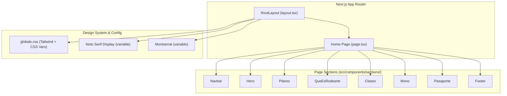
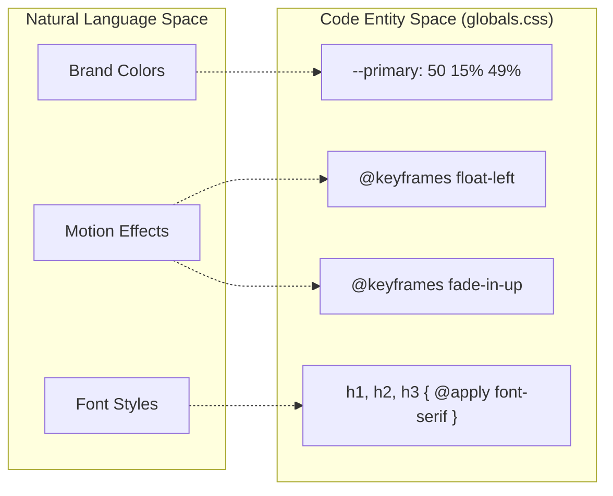

# Application Architecture

This page provides a high-level overview of the Rodearte application's structural design. The project is built using the **Next.js App Router**, leveraging a component-based architecture to assemble a responsive, single-page landing experience. The architecture integrates a custom design system with global styles and utility functions to ensure visual consistency and performant font loading.

### Core Architecture Overview

The application follows a standard Next.js 14+ structure where the root layout defines the global environment (fonts, metadata, and styles), and the main entry page composes individual functional sections.

The following diagram illustrates the relationship between the core layout, the global configuration, and the page composition:

**System Composition Diagram**

Sources: [src/app/layout.tsx:22-34](), [src/app/page.tsx:10-35]()

---

### Root Layout and Page Composition

The `RootLayout` serves as the entry point for the entire application. It is responsible for configuring the HTML language attribute, injecting global CSS, and implementing the font loading strategy using `next/font/google`. The layout wraps the `Home` component, which acts as the orchestrator for all UI sections.

*   **Font Strategy**: Uses `Noto_Serif_Display` for headings and `Montserrat` for body text, mapped to CSS variables `--font-serif` and `--font-sans`.
*   **Composition**: The `Home` component [src/app/page.tsx:10-35]() imports and renders sections in a specific sequence to form the landing page.

For details on font loading, metadata, and the composition order, see [Root Layout and Page Composition](#2.1).

Sources: [src/app/layout.tsx:5-32](), [src/app/page.tsx:1-35]()

---

### Design System and Global Styles

Rodearte utilizes a custom color palette defined via CSS variables within Tailwind CSS's `@layer base`. This system supports both light and dark modes by remapping variables like `--background` and `--foreground`.

**Code-to-System Mapping: Styles and Animations**

Sources: [src/app/globals.css:6-53](), [src/app/globals.css:124-176]()

The design system also includes specialized animation keyframes such as `float-left`, `float-right`, and `float-center` to provide a "somatic" organic feel to the UI.

For details on the color palette, Tailwind configuration, and custom animations, see [Design System and Global Styles](#2.2).

Sources: [src/app/globals.css:1-177]()

---

### Utilities, Hooks, and Types

The application infrastructure is supported by a set of utilities and hooks designed to handle common tasks:
*   **Class Merging**: A `cn()` utility (combining `clsx` and `tailwind-merge`) is used throughout the components to manage conditional styling.
*   **Scroll Detection**: The `useScroll` hook enables the `Navbar` to change its visual state (e.g., swapping logos or background transparency) based on the user's scroll position.
*   **Type Safety**: Global TypeScript definitions ensure consistency for data structures like `NavItem` and `Feature`.

For details on the utility infrastructure and custom hooks, see [Utilities, Hooks, and Types](#2.3).

Sources: [src/app/page.tsx:13-13](), [src/app/layout.tsx:1-3]()

---
