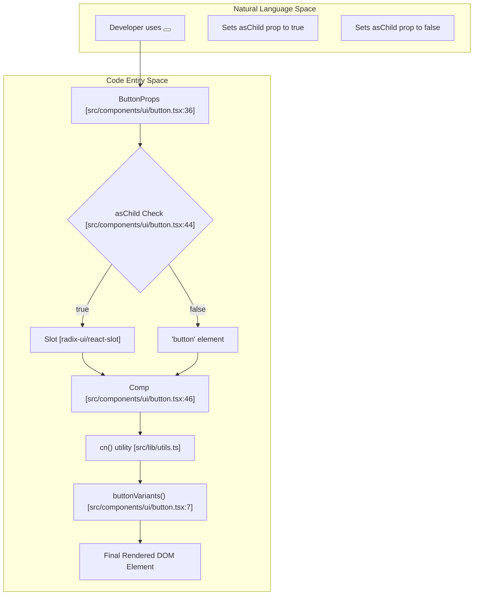
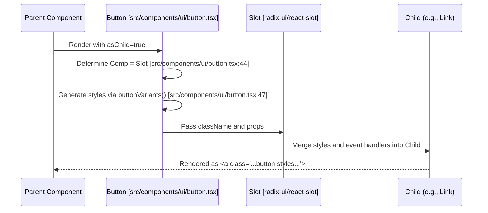

# Button Component
The `Button` component is a foundational UI primitive in the Rodearte codebase, built using the **shadcn/ui** pattern. It leverages `class-variance-authority` (CVA) for style orchestration, `clsx`/`tailwind-merge` for dynamic class application, and Radix UI's `Slot` for polymorphic rendering.

## Component Overview

The component is defined as a forward-ref component, allowing it to pass refs to the underlying DOM element or the `Slot` component when `asChild` is active [src/components/ui/button.tsx:42-43](). It serves as the primary interactive element for triggers, links, and form submissions across the application.

### Implementation Details

| Feature | Implementation |
| :--- | :--- |
| **Styling Engine** | `class-variance-authority` (CVA) [src/components/ui/button.tsx:7]() |
| **Polymorphism** | `@radix-ui/react-slot` via the `asChild` prop [src/components/ui/button.tsx:2,39,44]() |
| **Class Merging** | Custom `cn()` utility [src/components/ui/button.tsx:5,47]() |
| **Ref Handling** | `React.forwardRef<HTMLButtonElement, ButtonProps>` [src/components/ui/button.tsx:42]() |

**Sources:**
- [src/components/ui/button.tsx:1-57]()

---

## Button Variants and Sizes

The visual appearance of the button is managed through the `buttonVariants` CVA configuration. This configuration defines a base set of styles (e.g., transitions, focus rings, disabled states) and then applies specific classes based on the `variant` and `size` props.

### Variant Definitions
[src/components/ui/button.tsx:11-21]()

*   **`default`**: The primary action style using `bg-primary` and `text-primary-foreground`.
*   **`destructive`**: Used for dangerous actions, applying `bg-destructive`.
*   **`outline`**: A bordered button with a transparent background that shifts to `bg-accent` on hover.
*   **`secondary`**: A muted alternative using `bg-secondary`.
*   **`ghost`**: No background or border; becomes visible only on hover.
*   **`link`**: Mimics a standard anchor tag with underlining on hover.

### Size Definitions
[src/components/ui/button.tsx:22-27]()

*   **`default`**: Height of 10 units (`h-10`) with standard padding.
*   **`sm`**: Smaller height (`h-9`) and reduced padding.
*   **`lg`**: Larger height (`h-11`) and increased horizontal padding.
*   **`icon`**: A square container (`h-10 w-10`) designed specifically for SVG icons.

**Sources:**
- [src/components/ui/button.tsx:7-34]()

---

## Data Flow and Composition

The `Button` component uses a conditional assignment to determine which element to render. This allows it to behave like a standard HTML `<button>` or adopt the behavior of a child component (like a Next.js `Link`).

### Component Logic Diagram
The following diagram illustrates how the `asChild` prop influences the rendering engine.

**Title: Button Component Rendering Logic**


**Sources:**
- [src/components/ui/button.tsx:36-50]()

---

## The asChild/Slot Pattern

The `asChild` prop is a critical feature for accessibility and SEO. When `asChild` is true, the `Button` component does not render its own DOM element. Instead, it uses the Radix UI `Slot` to merge its props (including the generated Tailwind classes) onto the immediate child element.

### Interaction with Next.js Link
This pattern is frequently used to style Next.js `Link` components as buttons without nesting a `<button>` inside an `<a>` tag, which is invalid HTML.

**Title: Polymorphic Component Interaction**


**Sources:**
- [src/components/ui/button.tsx:2,39,44,46]()

---

## Technical Specifications

### Types and Interfaces
The component exports the `ButtonProps` interface, which combines standard HTML button attributes with the variant props generated by CVA.

```typescript
export interface ButtonProps
  extends React.ButtonHTMLAttributes<HTMLButtonElement>,
    VariantProps<typeof buttonVariants> {
  asChild?: boolean
}
```
[src/components/ui/button.tsx:36-40]()

### Class Merging
The `cn` utility is used to merge the output of `buttonVariants` with any custom `className` passed as a prop. This ensures that Tailwind class collisions (e.g., two different padding values) are resolved correctly by `tailwind-merge`.

```typescript
className={cn(buttonVariants({ variant, size, className }))}
```
[src/components/ui/button.tsx:47]()

**Sources:**
- [src/components/ui/button.tsx:36-56]()
