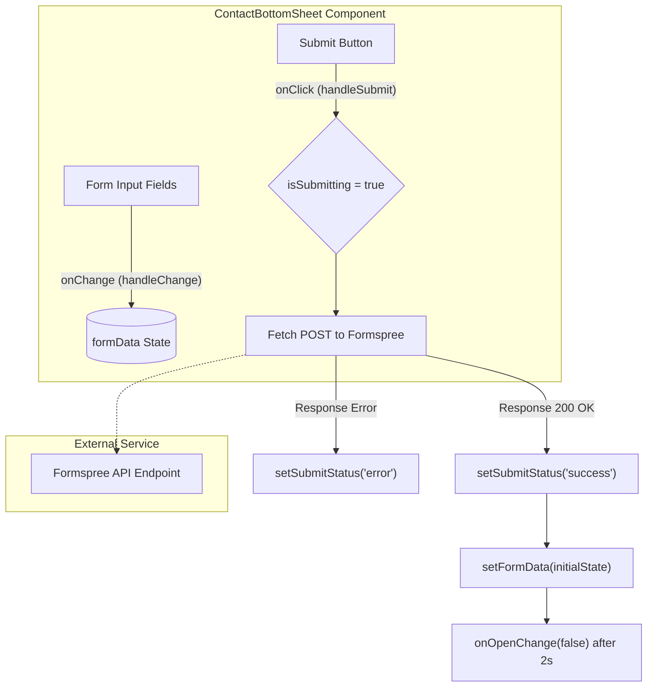
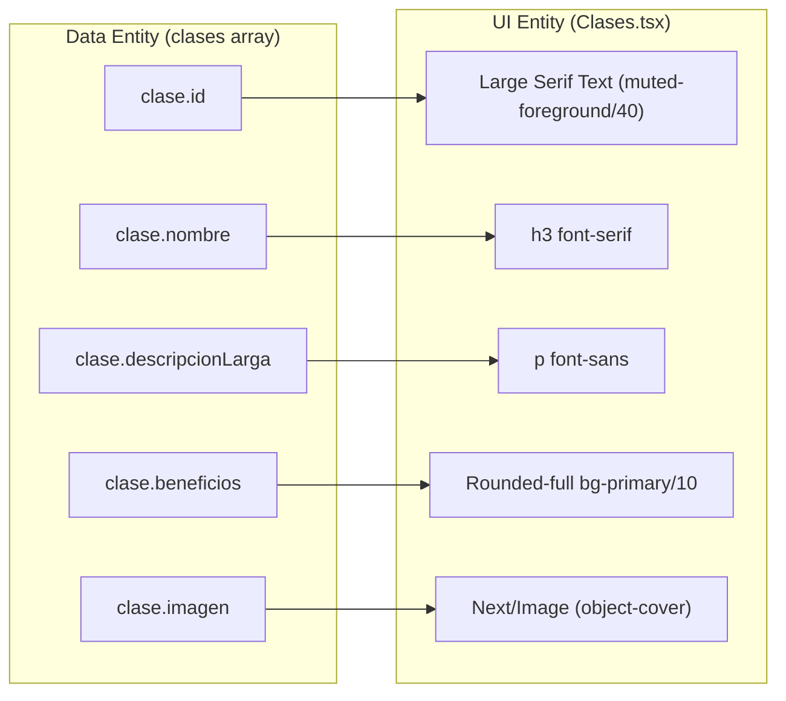

# Clases Section and Contact Bottom Sheet
This page documents the `Clases` section, which serves as the service catalog for Rodearte, and the `ContactBottomSheet` component, which provides a unified lead generation form integrated with Formspree.

## Clases Section

The `Clases` component provides a detailed overview of the four core service offerings: **Full Body**, **Deep Stretch**, **Somática Creativa**, and **Relajación & Breathwork** [src/components/sections/Clases.tsx:5-54](). It uses a structured grid layout that alternates between text content and optimized imagery.

### Data Structure
The services are defined in a `clases` constant array. Each object includes:
*   **Identification**: A string `id` used for visual numbering (e.g., "01") [src/components/sections/Clases.tsx:7]().
*   **Content**: `nombre`, `descripcion` (short), and `descripcionLarga` (detailed) [src/components/sections/Clases.tsx:8-10]().
*   **Beneficios**: An array of objects containing a `label` and a Lucide `icon` (e.g., `Zap`, `Heart`, `Wind`) [src/components/sections/Clases.tsx:11-15]().
*   **Media**: A path to a local image asset in `public/jpg/` [src/components/sections/Clases.tsx:16]().

### Layout Implementation
The component renders a vertical list where each item is separated by a subtle border [src/components/sections/Clases.tsx:80](). 
*   **Grid System**: Uses a responsive grid `grid-cols-1 lg:grid-cols-[auto_1fr_auto]` to align the index number, the text content, and the image side-by-side on large screens [src/components/sections/Clases.tsx:82]().
*   **Image Handling**: Images are rendered using the Next.js `Image` component with `fill` and `object-cover` to ensure they fill their `relative` container while maintaining aspect ratios [src/components/sections/Clases.tsx:120-128]().

**Sources:** [src/components/sections/Clases.tsx:1-137]()

---

## Contact Bottom Sheet

The `ContactBottomSheet` is a controlled modal component built on top of the `Sheet` primitive [src/components/contact/ContactBottomSheet.tsx:5-11](). It provides a sliding drawer from the bottom of the viewport containing a contact form.

### State Management
The component manages three primary pieces of state:
1.  **`formData`**: An object tracking `name`, `email`, `phone`, and `message` [src/components/contact/ContactBottomSheet.tsx:24-29]().
2.  **`isSubmitting`**: A boolean flag to disable the submit button and show a loading state [src/components/contact/ContactBottomSheet.tsx:30]().
3.  **`submitStatus`**: Tracks whether the submission was a `success` or `error`, along with the feedback message [src/components/contact/ContactBottomSheet.tsx:31-34]().

### Submission Lifecycle
The form integrates with **Formspree** via a POST request to a specific endpoint [src/components/contact/ContactBottomSheet.tsx:49]().

| Stage | Action | Code Reference |
| :--- | :--- | :--- |
| **Trigger** | `handleSubmit` called on form submit | [src/components/contact/ContactBottomSheet.tsx:43]() |
| **Pending** | `isSubmitting` set to true; status cleared | [src/components/contact/ContactBottomSheet.tsx:45-46]() |
| **Request** | Fetch call to `https://formspree.io/f/xdkqgwva` | [src/components/contact/ContactBottomSheet.tsx:49]() |
| **Success** | Reset form; show success UI; close sheet after 2s | [src/components/contact/ContactBottomSheet.tsx:57-66]() |
| **Failure** | Catch error; show error UI; stop loading | [src/components/contact/ContactBottomSheet.tsx:70-78]() |

### Cancel and Reset Flow
The "Cancelar" button uses `SheetClose` as a child [src/components/contact/ContactBottomSheet.tsx:194](). It includes an `onClick` handler to explicitly clear the `formData` and `submitStatus` states, ensuring that if a user re-opens the sheet, they encounter a fresh form [src/components/contact/ContactBottomSheet.tsx:199-202]().

**Sources:** [src/components/contact/ContactBottomSheet.tsx:1-212]()

---

## System Integration Diagrams

### Component Hierarchy and Data Flow
This diagram shows how the `ContactBottomSheet` manages the transition from user input to external API communication.

Title: Contact Form State and Submission Flow

**Sources:** [src/components/contact/ContactBottomSheet.tsx:24-79]()

### Service Data Mapping
This diagram maps the `clases` data structure to the visual entities rendered in the `Clases` section.

Title: Clases Data-to-UI Mapping

**Sources:** [src/components/sections/Clases.tsx:5-54](), [src/components/sections/Clases.tsx:75-132]()
