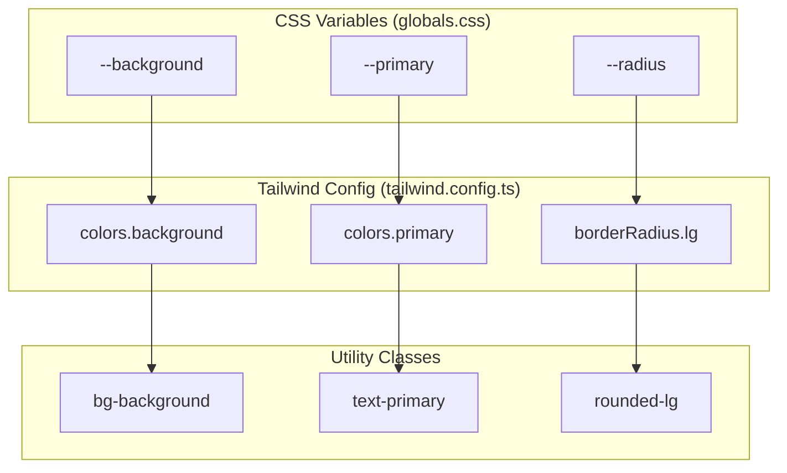
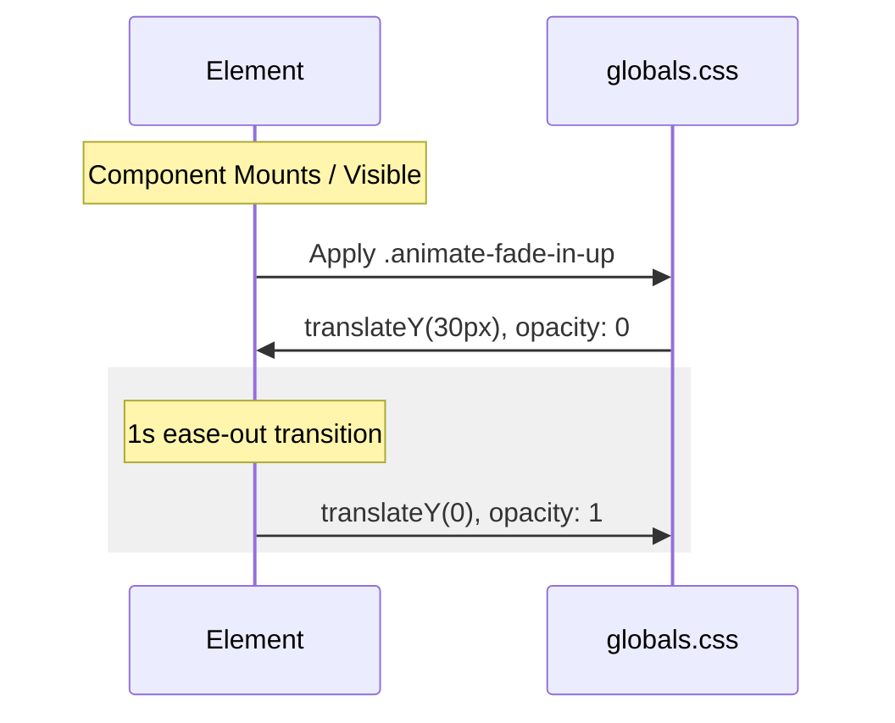

# Design System and Global Styles
The Rodearte design system is built on a foundation of Tailwind CSS, utilizing HSL-based CSS variables to manage a cohesive brand identity across light and dark modes. The system emphasizes organic movement through custom keyframe animations and a specific typography pairing of serif and sans-serif fonts.

## Color Palette and Theming

The application uses a custom color palette defined in `src/app/globals.css`. These colors are mapped to Tailwind utility classes via `tailwind.config.ts`. The primary brand colors consist of earthy tones: Crema claro (Light Cream), Verde oliva (Olive Green), and Beige.

### Light Mode Variables
In the default `:root` state, the palette focuses on a light, airy aesthetic [src/app/globals.css:6-53]().

| Variable | HSL Value | Hex Equivalent (Approx) | Description |
| :--- | :--- | :--- | :--- |
| `--background` | `50 20% 97%` | #faf9f5 | Main background (Crema claro) |
| `--foreground` | `85 15% 29%` | #4e5640 | Main text color (Verde oliva oscuro) |
| `--primary` | `50 15% 49%` | #8d876b | Primary brand color (Verde oliva medio) |
| `--secondary` | `35 20% 72%` | #c5baa8 | Secondary UI elements (Beige) |
| `--muted` | `35 20% 72%` | #c5baa8 | De-emphasized elements |

### Dark Mode Variables
The `.dark` class overrides these variables to provide an inverted palette [src/app/globals.css:55-100](). The configuration in `tailwind.config.ts` uses the `class` strategy for dark mode [tailwind.config.ts:4-4]().

### Tailwind Integration
The `tailwind.config.ts` file maps these CSS variables to Tailwind's theme system using the `hsl()` function [tailwind.config.ts:16-57](). This allows for the use of utility classes like `bg-primary` or `text-foreground`.

**Theme Configuration Mapping**

**Sources:** [src/app/globals.css:6-100](), [tailwind.config.ts:16-62]()

## Typography

Rodearte uses a dual-font strategy. Headings (`h1` through `h6`) are globally set to use the serif font [src/app/globals.css:110-112]().

*   **Serif Font:** Configured as `var(--font-serif)` (Noto Serif Display), mapped to the `font-serif` class [tailwind.config.ts:13-13]().
*   **Sans-Serif Font:** Configured as `var(--font-sans)` (Montserrat), mapped to the `font-sans` class [tailwind.config.ts:14-14]().

Custom utility classes `.font-title` and `.font-body` are also provided for explicit overrides [src/app/globals.css:115-122]().

**Sources:** [src/app/globals.css:110-122](), [tailwind.config.ts:12-15]()

## Animations

The design system includes custom CSS keyframes to simulate "somatic movement" and organic flow throughout the landing page.

### Floating Animations
Three variations of horizontal floating are defined to create depth in grid layouts (such as the "Pilares" or "Mono" sections).

| Class | Keyframe | Behavior | Duration |
| :--- | :--- | :--- | :--- |
| `.animate-float-left` | `float-left` | Translates -15px on X-axis [src/app/globals.css:124-131]() | 6s |
| `.animate-float-right` | `float-right` | Translates 15px on X-axis [src/app/globals.css:133-140]() | 7s |
| `.animate-float-center` | `float-center` | Translates 10px on X-axis [src/app/globals.css:142-149]() | 8s |

### Entrance Animations
The `.animate-fade-in-up` class is used for content appearing as the user scrolls. It transitions an element from `opacity: 0` and `translateY(30px)` to its final state over 1 second [src/app/globals.css:163-176]().

**Animation Flow**

**Sources:** [src/app/globals.css:124-176]()

## PostCSS Pipeline

The project uses a standard PostCSS pipeline to process Tailwind CSS and ensure cross-browser compatibility.

*   **Tailwind CSS:** Processes utility classes and `@layer` directives [postcss.config.mjs:4-4]().
*   **Autoprefixer:** Automatically adds vendor prefixes to CSS rules (e.g., for animations and flexbox) [postcss.config.mjs:5-5]().

The pipeline is configured in `postcss.config.mjs` and is executed during the Next.js build process.

**Sources:** [postcss.config.mjs:1-9]()
