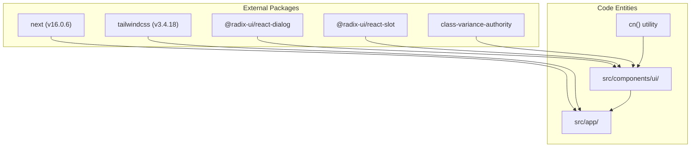
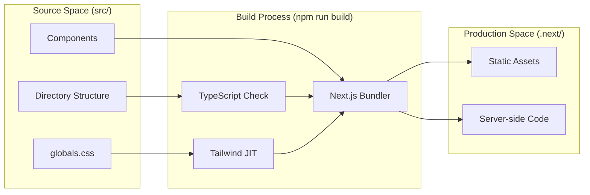

# Getting Started
This page provides a comprehensive guide for developers to set up the Rodearte development environment, execute local builds, and understand the command-line interface provided by the project's build system.

## 1. Environment Prerequisites

Rodearte is built using the **Next.js 16** framework with **TypeScript** and **Tailwind CSS** [README.md:5-10](). Before beginning, ensure you have the following installed:

*   **Node.js**: Recommended version 18.x or higher (due to Next.js 16 requirements).
*   **npm**: The project uses npm as its primary package manager [README.md:52-54]().

### Configuration Baseline
The project includes several configuration files that define the environment:
*   `tsconfig.json`: Configures the TypeScript compiler, targeting `ES2017` and using `bundler` module resolution [tsconfig.json:3-15](). It also defines a path alias `@/*` pointing to the `src/` directory [tsconfig.json:25-29]().
*   `next.config.mjs`: Standard Next.js configuration [next.config.mjs:1-4]().
*   `.eslintrc.json`: Extends `next/core-web-vitals` for linting rules [eslintrc.json:1-3]().

**Sources:** [README.md:5-10](), [tsconfig.json:1-42](), [next.config.mjs:1-4](), [eslintrc.json:1-3]()

---

## 2. Setup and Installation

To initialize the project locally, follow these steps:

1.  **Clone the repository**: Download the source code from the repository.
2.  **Install Dependencies**: Run the installation command to fetch all required packages, including Radix UI primitives and Tailwind utilities [package.json:15-35]().
    ```bash
    npm install
    ```
3.  **Local Environment Variables**: If specific integrations (like Formspree) require keys, create a `.env.local` file. Note that `.env*.local` files are ignored by version control [gitignore:28-30]().

### Dependency Graph to Code Entity Space
The following diagram maps the primary dependencies to their roles within the Rodearte codebase.

**System Dependency Mapping**

**Sources:** [package.json:15-35](), [README.md:12-26]()

---

## 3. Available Scripts

The project defines several `npm` scripts in `package.json` to manage the application lifecycle [package.json:6-11]().

| Command | Action | Description |
| :--- | :--- | :--- |
| `npm run dev` | `next dev` | Starts a development server with Hot Module Replacement (HMR) at `http://localhost:3000` [README.md:58-62](). |
| `npm run build` | `next build` | Compiles the application for production, generating optimized assets in the `.next/` folder [README.md:34-35](). |
| `npm start` | `next start` | Runs the compiled production build [README.md:37-38](). |
| `npm run lint` | `next lint` | Runs ESLint to check for code quality and Next.js best practices [README.md:40-41](). |

**Sources:** [package.json:6-11](), [README.md:28-42](), [README.md:56-62]()

---

## 4. Development Workflow

### Local Development
When running `npm run dev`, Next.js compiles assets on demand. The entry point for the application structure is `src/app/layout.tsx`, while the main content resides in `src/app/page.tsx` [README.md:16-19]().

### Build Pipeline
The `npm run build` command triggers the Next.js build pipeline, which:
1.  Validates TypeScript types using `tsconfig.json`.
2.  Processes CSS through PostCSS and Tailwind [package.json:28-32]().
3.  Optimizes images and minifies JavaScript.

### Data Flow: Development to Production
The following diagram illustrates how code entities move through the build pipeline.

**Build Pipeline Flow**

**Sources:** [README.md:12-26](), [package.json:6-11](), [tsconfig.json:1-42]()

---

## 5. Directory Organization

Understanding the layout of `src/` is critical for navigating the codebase:

*   **`src/app/`**: Contains the App Router logic, including `layout.tsx` for global providers and `page.tsx` for the main landing page [README.md:16-19]().
*   **`src/components/sections/`**: Contains the modular sections of the landing page (Hero, Pilares, etc.) [README.md:22]().
*   **`src/components/ui/`**: Reusable UI primitives built with `shadcn/ui` and `radix-ui` [README.md:21]().
*   **`src/lib/`**: Utility functions, such as the `cn` helper for Tailwind class merging [README.md:23]().
*   **`src/hooks/`**: Custom React hooks for shared logic [README.md:24]().

**Sources:** [README.md:12-26]()
