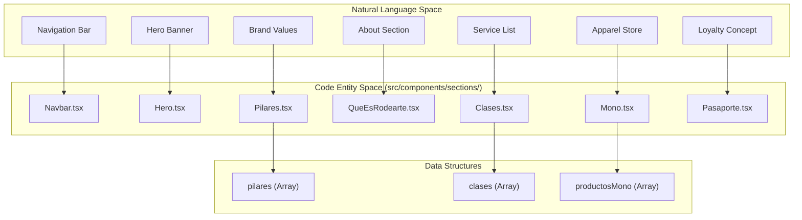
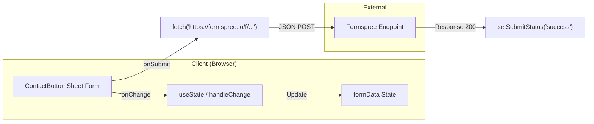

# Glossary

This page defines the technical terminology, domain-specific Spanish vocabulary, and codebase entities used within the Rodearte project. It serves as a reference for maintaining consistency across the application's somatic movement branding and its React implementation.

## 1. Domain Vocabulary (Spanish)

The Rodearte codebase uses specific Spanish terms that represent the brand's philosophy and business offerings.

| Term | Translation / Context | Implementation Note |
|:---|:---|:---|
| **Somática** | Somatics | The primary methodology of the studio, emphasized in `Hero` and `QueEsRodearte`. |
| **Pilar** | Pillar | Core brand values defined in the `Pilares` component [src/components/sections/Pilares.tsx:3-25](). |
| **Mono** | Jumpsuit / Apparel | Refers to the clothing line featured in the `Mono` section [src/components/sections/Mono.tsx:24](). |
| **Pasaporte** | Passport | A physical attendance tracking concept represented digitally in `Pasaporte.tsx` [src/components/sections/Pasaporte.tsx:24-50](). |
| **Clases** | Classes | The service offerings (Full Body, Deep Stretch, etc.) [src/components/sections/Clases.tsx:5-54](). |

**Sources:** [src/components/sections/Pilares.tsx:3-25](), [src/components/sections/Mono.tsx:24](), [src/components/sections/Pasaporte.tsx:24-50](), [src/components/sections/Clases.tsx:5-54]().

---

## 2. Technical Design Tokens

Rodearte uses a custom Tailwind CSS configuration driven by CSS variables to maintain its "Earthly/Somatic" aesthetic.

### Color Palette
Defined in `globals.css`, these tokens map to HSL values.

*   `--primary`: Olive Medium (#8d876b). Used for main backgrounds and accents [src/app/globals.css:20-21]().
*   `--foreground`: Olive Dark (#4e5640). Used for primary text [src/app/globals.css:10-11]().
*   `--background`: Light Cream (#faf9f5). Used for page and card backgrounds [src/app/globals.css:8-9]().
*   `--secondary`: Beige (#c5baa8). Used for borders and muted elements [src/app/globals.css:24-25]().

### Animation Tokens
Custom keyframes used to simulate organic, fluid movement.

*   `animate-float-left`: Horizontal oscillation (15px) over 6s [src/app/globals.css:124-131]().
*   `animate-float-right`: Horizontal oscillation (15px) over 7s [src/app/globals.css:133-140]().
*   `animate-float-center`: Subtle oscillation (10px) over 8s [src/app/globals.css:142-149]().
*   `animate-fade-in-up`: Entrance animation (30px slide + opacity) [src/app/globals.css:163-176]().

**Sources:** [src/app/globals.css:8-53](), [src/app/globals.css:124-176]().

---

## 3. Core Code Entities

### Component Mapping: Natural Language to Code
The following diagram maps user-facing sections of the landing page to their respective React components and data structures.

Title: Rodearte Page Composition Mapping

**Sources:** [src/app/page.tsx:1-35](), [src/components/sections/Pilares.tsx:3-25](), [src/components/sections/Clases.tsx:5-54](), [src/components/sections/Mono.tsx:3-22]().

### Infrastructure and Utilities
Key logic providers that support the UI components.

*   `useScroll(threshold)`: A custom hook that returns a boolean `isScrolled` when the window Y-offset exceeds the threshold [src/components/sections/Navbar.tsx:27]().
*   `cn(...inputs)`: A utility combining `clsx` and `tailwind-merge` for conditional class application [src/lib/utils.ts]().
*   `ContactBottomSheet`: A client-side component managing the Formspree integration for the contact form [src/components/contact/ContactBottomSheet.tsx:20-212]().

Title: Data Flow - Contact Submission

**Sources:** [src/components/contact/ContactBottomSheet.tsx:43-79](), [src/components/contact/ContactBottomSheet.tsx:24-41]().

---

## 4. Asset Conventions

### Logos
The project uses a numbered library of SVGs located in `public/logos/`.
*   `/logos/1.svg`: Default light logo (white) used in Hero and transparent Navbar [src/components/sections/Navbar.tsx:48]().
*   `/logos/8.svg`: Darker variant used when the Navbar is scrolled [src/components/sections/Navbar.tsx:48]().
*   `/logos/6.svg`: Mobile-specific logo used in the Footer [src/components/sections/Footer.tsx:32]().

### Photography
Images are optimized via `next/image` and follow a naming convention of `Rodearte_01-XX.jpg`.
*   `aboutUs.avif`: Used as the full-viewport background for the `QueEsRodearte` section [src/components/sections/QueEsRodearte.tsx:11]().
*   `-.png`: A specific asset used as the background for the `Pasaporte` section [src/components/sections/Pasaporte.tsx:10]().

**Sources:** [src/components/sections/Navbar.tsx:47-58](), [src/components/sections/Footer.tsx:31-45](), [src/components/sections/QueEsRodearte.tsx:10-17](), [src/components/sections/Pasaporte.tsx:9-16]().
