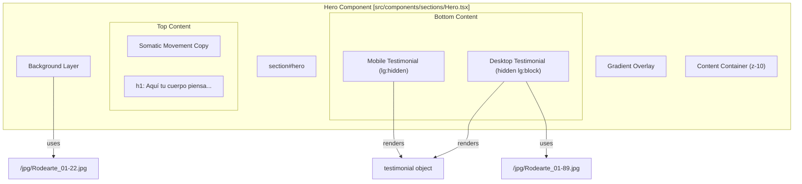
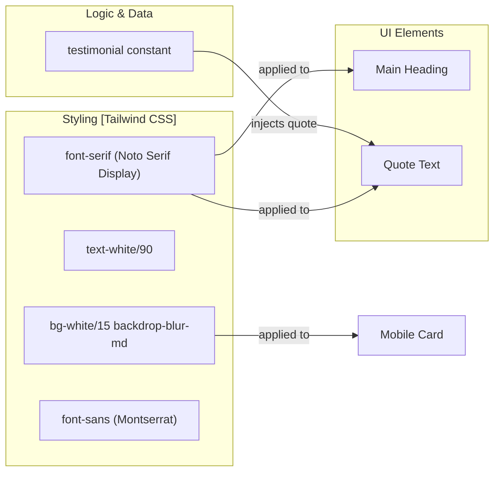

# Hero Section
The Hero section serves as the primary landing interface for Rodearte, designed to immediately communicate the brand's core identity: a somatic movement studio. It utilizes a sophisticated layering strategy to blend high-quality photography with readable, accessible brand copy and community testimonials.

## Visual Layering Strategy

The component employs a three-layer stacking context to achieve its visual depth while maintaining text legibility.

1.  **Background Image Layer**: A full-viewport background using the Next.js `Image` component. It uses the `priority` attribute to ensure it is one of the first assets loaded, minimizing Largest Contentful Paint (LCP) [src/components/sections/Hero.tsx:21-28]().
2.  **Gradient Overlay Layer**: An absolute-positioned `div` using a diagonal gradient (`bg-gradient-to-br`) from the theme's background color at 20% opacity to transparent. This subtle "wash" ensures that white text remains readable regardless of the underlying image's brightness [src/components/sections/Hero.tsx:30-30]().
3.  **Content Layer**: A high-index relative container that houses the typography and the testimonial blocks [src/components/sections/Hero.tsx:32-32]().

### Component Architecture

The following diagram illustrates the relationship between the React component structure and the visual assets.

**Hero Component Composition**

Sources: [src/components/sections/Hero.tsx:13-114]()

## Testimonial Layout & Responsive Design

The Hero section features a dual-layout strategy for testimonials to optimize the user experience across devices.

### Mobile Layout
On small screens (`lg:hidden`), the section displays a simplified "glassmorphism" card. This card uses a semi-transparent white background with a blur effect to stand out against the background image [src/components/sections/Hero.tsx:47-56]().

### Desktop Layout
On large screens (`hidden lg:block`), the layout expands into a multi-column grid [src/components/sections/Hero.tsx:59-109]():
*   **Column 1**: A detailed testimonial card containing an inset image (`Rodearte_01-89.jpg`), the community quote, and the author [src/components/sections/Hero.tsx:75-95]().
*   **Column 2**: A vertical divider [src/components/sections/Hero.tsx:97-97]().
*   **Column 3**: A descriptive paragraph detailing the Rodearte community philosophy (somatic movement, creative rhythm) [src/components/sections/Hero.tsx:99-106]().

| Feature | Mobile Implementation | Desktop Implementation |
| :--- | :--- | :--- |
| **Testimonial Image** | Hidden | Visible (Inset 176px width) |
| **Grid System** | Single column flex | `lg:grid-cols-[minmax(0,1.4fr)_1px_minmax(0,1fr)]` |
| **Backdrop Blur** | `backdrop-blur-md` | `backdrop-blur-sm` |
| **Border Radius** | `rounded-2xl` | `rounded-[28px]` |

Sources: [src/components/sections/Hero.tsx:45-110]()

## Somatic Brand Copy

The section serves as the semantic anchor for the site's "somatic" vocabulary.

*   **Main Headline**: "Aquí tu cuerpo piensa, respira y vuelve a ti" [src/components/sections/Hero.tsx:37-39]().
*   **Sub-headline**: "Un espacio íntimo para escucharte y habitarte" [src/components/sections/Hero.tsx:40-42]().
*   **Community Description**: Emphasizes "escucha profunda" (deep listening) and "acompañamiento humano" (human accompaniment) [src/components/sections/Hero.tsx:101-104]().

### Implementation Details

**Data Flow and Style Application**

Sources: [src/components/sections/Hero.tsx:7-11](), [src/components/sections/Hero.tsx:37-39](), [src/components/sections/Hero.tsx:48-48]()

## Assets Used
*   **Main Background**: `/jpg/Rodearte_01-22.jpg` [src/components/sections/Hero.tsx:22-22]()
*   **Testimonial Portrait**: `/jpg/Rodearte_01-89.jpg` [src/components/sections/Hero.tsx:79-79]()

Sources: [src/components/sections/Hero.tsx:21-29](), [src/components/sections/Hero.tsx:77-85]()
