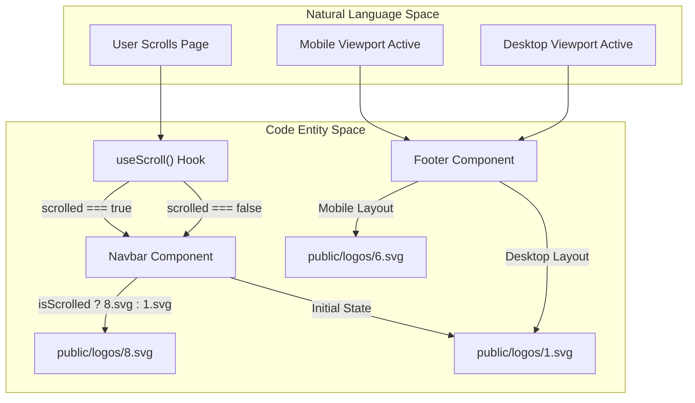
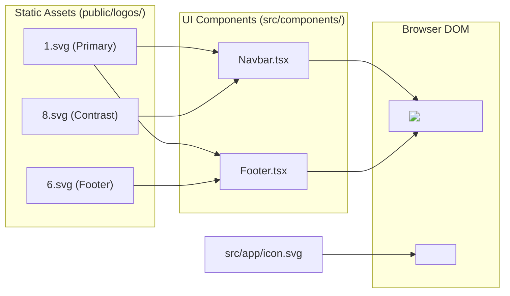

# Logo SVG Library

The Rodearte project utilizes a comprehensive library of SVG assets to maintain brand consistency across different UI contexts, including the navigation bar, footer, and browser metadata. These assets are categorized into numbered variants for specific UI states and a dedicated application icon for platform integration.

## 1. Numbered Logo Variants

The directory `public/logos/` contains a series of SVG files numbered `1.svg` through `29.svg`. These variants allow the application to swap logos dynamically based on the background color, scroll position, or device viewport.

### 1.1 Key Logo Contexts

The application logic primarily references specific indices from this library to handle visual transitions:

| File Path | Usage Context | Description |
|:---|:---|:---|
| `public/logos/1.svg` | Navbar (Initial) / Footer (Desktop) | The primary brand logo used when the Navbar is transparent and in the desktop footer. |
| `public/logos/8.svg` | Navbar (Scrolled) | A high-contrast variant swapped in when the user scrolls, triggered by the `useScroll` hook. |
| `public/logos/6.svg` | Footer (Mobile) | A specific variant optimized for the mobile footer layout. |

### 1.2 SVG Structure and Filtering

Many of the logos (specifically variants `10` through `29`) utilize advanced SVG features such as `<defs>`, `<filter>`, and `<mask>` to achieve specific visual effects. These files often embed base64 encoded image data to combine vector paths with rasterized textures.

*   **Color Matrices:** Variants like `10.svg` and `11.svg` use `<feColorMatrix>` to manipulate color interpolation filters [public/logos/10.svg:5-6](), [public/logos/11.svg:5-6]().
*   **Masking:** Implementation of masks (e.g., `id="c6e0d30051"`) allows for complex transparency patterns between vector shapes and embedded images [public/logos/10.svg:8-10]().

**Sources:** [public/logos/1.svg:1-10](), [public/logos/10.svg:1-10](), [public/logos/11.svg:1-10](), [public/logos/13.svg:1-10](), [public/logos/17.svg:1-10](), [public/logos/19.svg:1-10](), [public/logos/22.svg:1-10](), [public/logos/25.svg:1-10](), [public/logos/26.svg:1-10](), [public/logos/29.svg:1-10]().

## 2. Application Icon (Favicon)

The file `src/app/icon.svg` serves as the source for the application's favicon and browser icons. Next.js automatically detects this file within the `app` directory to generate the necessary metadata for the web application.

*   **Technical Specifications:** The icon is defined with a `viewBox="0 0 810 1012.49997"` and uses a single complex `<path>` with a fill color of `#fcfbf8` [src/app/icon.svg:3-4]().
*   **Role:** It represents the brand in browser tabs, bookmarks, and mobile home screen shortcuts.

**Sources:** [src/app/icon.svg:1-4]().

## 3. Implementation Logic

The following diagram illustrates how the `Navbar` and `Footer` components interact with the `public/logos/` library based on application state.

**Logo Selection Logic Flow**

**Sources:** [public/logos/1.svg:1-10](), [public/logos/8.svg:1-10](), [public/logos/6.svg:1-10]().

## 4. Asset Data Flow

The SVG assets are served as static files. The following diagram shows the relationship between the file system and the rendered DOM entities.

**SVG Asset Data Flow**

**Sources:** [src/app/icon.svg:1-4](), [public/logos/1.svg:1-10](), [public/logos/8.svg:1-10]().

Would you like the summary of the next segment, "6. Glossary"?

---
