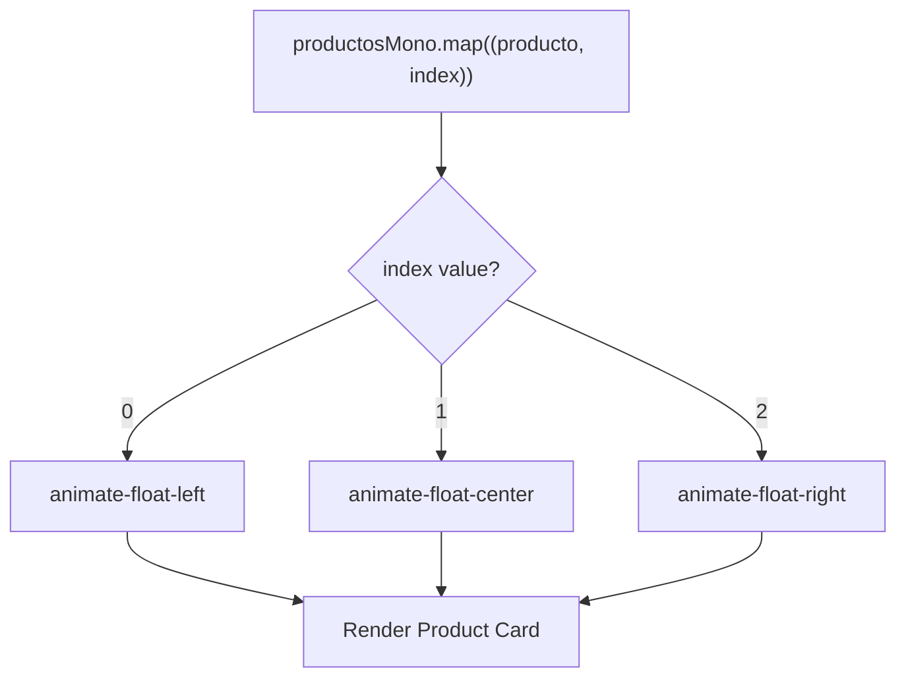
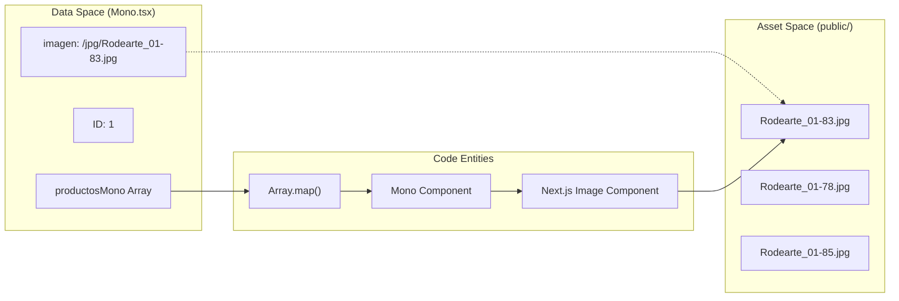

# Mono Section (Apparel)

The `Mono` component documents the apparel line of the Rodearte brand. It serves as a product showcase section, utilizing a structured data schema to render a responsive grid of product cards. The section is characterized by dynamic floating animations, high-quality image optimization, and a minimalist design aesthetic that aligns with the brand's somatic identity.

## Product Data Schema

The section's content is driven by a static array of objects named `productosMono`. Each object represents a single apparel item and contains metadata used for rendering both the visual and textual elements of the product card.

| Property | Type | Description |
| :--- | :--- | :--- |
| `id` | `number` | Unique identifier for the product. |
| `nombre` | `string` | The display name of the garment (e.g., "Pieza esencial"). |
| `descripcion` | `string` | A short tagline or brand-aligned description. |
| `imagen` | `string` | Relative path to the optimized JPG asset in `/public/jpg/`. |

**Sources:**
- [src/components/sections/Mono.tsx:3-22]()

## Component Architecture

The `Mono` function is a functional component that maps over the `productosMono` array to generate a 3-column grid. It implements a specific layout strategy for mobile (stacked) versus desktop (side-by-side).

### Grid Implementation
The layout uses Tailwind CSS grid utilities:
- **Container**: Uses `py-16 md:py-24` for vertical padding and the `bg-primary` color variable for the background [src/components/sections/Mono.tsx:26-26]().
- **Grid System**: Defined as `grid grid-cols-1 md:grid-cols-3` with a gap of `gap-6 md:gap-8` [src/components/sections/Mono.tsx:28-28]().

### Animation Assignment Logic
To create visual variety, the component dynamically assigns CSS animation classes based on the product's index in the array.

**Sources:**
- [src/components/sections/Mono.tsx:29-39]()

## Product Card Design

Each product card is composed of a relative container that manages the image aspect ratio and an absolute-positioned overlay for text.

### Image Handling
The component utilizes the Next.js `Image` component with the `fill` property to ensure responsive behavior within a fixed aspect ratio container.
- **Aspect Ratio**: The container uses `aspect-[4/5]` to maintain a consistent portrait orientation [src/components/sections/Mono.tsx:40-40]().
- **Optimization**: The `sizes` attribute is configured as `(max-width: 768px) 100vw, 33vw` to serve appropriately scaled images based on the viewport [src/components/sections/Mono.tsx:46-46]().
- **Styling**: Images use `object-cover` to prevent distortion while filling the rounded container [src/components/sections/Mono.tsx:45-45]().

### Content Overlay
The product details are housed in a floating card overlay:
- **Positioning**: `absolute bottom-4 right-4` [src/components/sections/Mono.tsx:48-48]().
- **Visuals**: Implements glassmorphism using `bg-background/80 backdrop-blur-md` and a subtle border `border-background/30` [src/components/sections/Mono.tsx:48-48]().
- **Typography**: Uses `font-serif` for product names and `font-sans` for descriptions [src/components/sections/Mono.tsx:49-54]().

**Sources:**
- [src/components/sections/Mono.tsx:40-57]()

## Data Flow and Asset Mapping

The following diagram illustrates how the `Mono` component bridges the static data definitions to the rendered UI entities and physical assets.

**Sources:**
- [src/components/sections/Mono.tsx:3-22]()
- [src/components/sections/Mono.tsx:41-47]()
- [public/jpg/Rodearte_01-83.jpg:1-14]()
- [public/jpg/Rodearte_01-85.jpg:1-15]()

## Footer Content
Below the product grid, a text block provides brand context. It is centered using `text-center max-w-3xl mx-auto` and features the copy: "Ropa de Rodearte, creada por Vanesa." The text color is set to `text-background/90` to contrast against the primary background.

**Sources:**
- [src/components/sections/Mono.tsx:62-67]()

---
