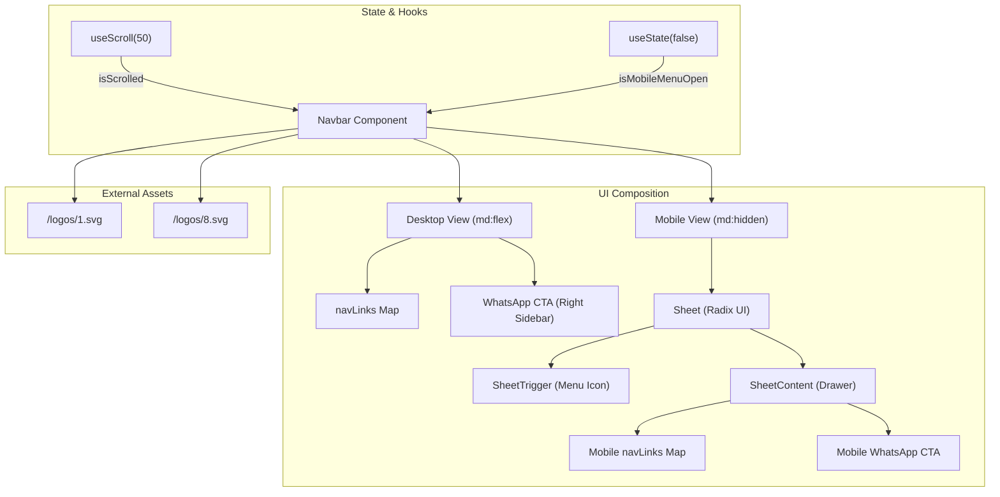
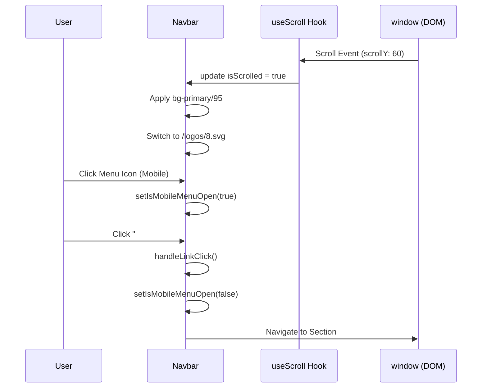

# Navbar
The `Navbar` component is a client-side navigation header that provides global site navigation, brand identity, and contact access. It is designed to be responsive, adapting its visual style based on the user's scroll position and the device viewport size.

## Visual and Functional Logic

The component utilizes a "sticky" positioning strategy and changes its theme dynamically to maintain readability against varying background sections.

### Scroll-Responsive Styling
The `Navbar` uses the custom `useScroll` hook to detect when the user has scrolled past a 50px threshold [src/components/sections/Navbar.tsx:27](). 

| State | Background | Border | Text Color | Logo |
| :--- | :--- | :--- | :--- | :--- |
| **Initial (Top)** | `bg-background/20` (Transparent/Glass) | `border-white/30` | `text-white` | `logos/1.svg` (Tan/Light) |
| **Scrolled (>50px)** | `bg-primary/95` (Solid Brand) | `border-border` | `text-foreground` | `logos/8.svg` (Dark/Green) |

Implementation details can be found in the `className` logic using the `cn` utility [src/components/sections/Navbar.tsx:36-41]().

### Logo Swap Logic
The brand logo dynamically switches between two SVG assets based on the `isScrolled` boolean [src/components/sections/Navbar.tsx:48]():
*   **Default:** `/logos/1.svg` is used for high contrast against dark hero backgrounds [public/logos/1.svg:1-3]().
*   **Scrolled:** `/logos/8.svg` is used when the navbar background becomes solid [public/logos/8.svg:1-3]().

## Navigation Structure

The links are defined in a static `navLinks` array [src/components/sections/Navbar.tsx:20-24]():
*   **Clases:** `#clases`
*   **Sobre:** `#sobre`
*   **Ropa:** `#mono`

### Desktop Navigation
On screens wider than the `md` breakpoint (768px), the links are displayed in a horizontal flex row [src/components/sections/Navbar.tsx:61-76](). A primary "Contacto" call-to-action (CTA) is pinned to the right side, leading to a WhatsApp URL [src/components/sections/Navbar.tsx:118-128]().

### Mobile Navigation (Sheet Drawer)
For mobile devices, the links are hidden behind a `Menu` icon trigger [src/components/sections/Navbar.tsx:79-83](). This trigger opens a `Sheet` (drawer) component that slides in from the right [src/components/sections/Navbar.tsx:84]().

**Sources:**
* [src/components/sections/Navbar.tsx:18-24]()
* [src/components/sections/Navbar.tsx:61-76]()
* [src/components/sections/Navbar.tsx:78-84]()

## Component Architecture

The following diagram illustrates the relationship between the UI components and the state management hooks.

**Navbar Component Structure**

**Sources:**
* [src/components/sections/Navbar.tsx:26-32]()
* [src/components/sections/Navbar.tsx:43-131]()
* [src/hooks/useScroll.ts:5-25]()

## Key Functions and Interaction Patterns

### handleLinkClick
The `handleLinkClick` function is used to ensure the mobile drawer closes immediately when a user selects a navigation anchor [src/components/sections/Navbar.tsx:30-32](). This is triggered via the `onClick` handler on mobile `Link` elements [src/components/sections/Navbar.tsx:93]().

### WhatsApp Integration
The contact link is centralized via the `WHATSAPP_URL` constant [src/components/sections/Navbar.tsx:18](). It uses `target="_blank"` and `rel="noopener noreferrer"` for security when opening the external messaging application [src/components/sections/Navbar.tsx:105-122]().

**Interaction Flow**

**Sources:**
* [src/components/sections/Navbar.tsx:18]()
* [src/components/sections/Navbar.tsx:30-32]()
* [src/components/sections/Navbar.tsx:93]()
* [src/hooks/useScroll.ts:9-12]()
