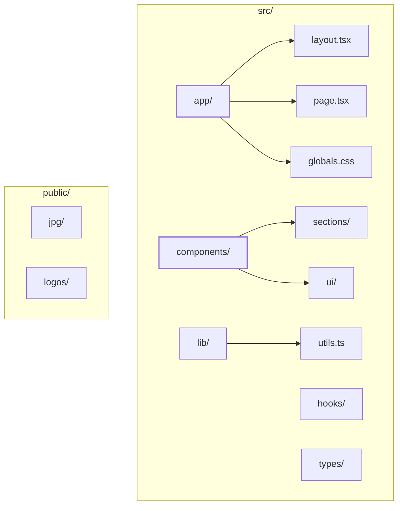

# Overview

Rodearte is a modern landing page application built with a focus on somatic movement, creative expression, and well-being. The codebase utilizes the **Next.js App Router** to deliver a performant, responsive, and visually rich user experience. It serves as a digital storefront and informational hub for the Rodearte brand, featuring sections for philosophy (Pilares), services (Clases), and apparel (Mono).

## System Purpose and Tech Stack

The project is designed as a single-page application (SPA) layout that prioritizes high-quality visual assets and smooth animations.

| Technology | Role |
| :--- | :--- |
| **Next.js 14+** | Core framework using the App Router for routing and server-side rendering [README.md:7-7](). |
| **TypeScript** | Provides static typing for components and data structures [README.md:8-8](). |
| **Tailwind CSS** | Utility-first CSS framework for styling and responsive design [README.md:9-9](). |
| **shadcn/ui** | Accessible UI primitives built on Radix UI [README.md:10-10](). |

For a step-by-step guide on environment setup and available scripts, see [Getting Started](#1.1).

## Codebase Organization

The project follows a modular structure within the `src/` directory, separating core application logic from reusable UI components and page-specific sections.

### High-Level Directory Map

Sources: [README.md:14-26]()

### Key Directories
*   **`src/app/`**: Contains the main entry points. `page.tsx` serves as the primary assembly point for all landing page sections [src/app/page.tsx:1-35]().
*   **`src/components/sections/`**: Contains large-scale components that represent distinct parts of the landing page, such as `Navbar`, `Hero`, and `Footer` [src/app/page.tsx:1-8]().
*   **`src/components/ui/`**: Houses low-level, reusable primitives (Buttons, Sheets, etc.) typically sourced from shadcn/ui [README.md:21-21]().
*   **`src/lib/`**: Contains helper functions like the `cn` utility for Tailwind class merging [README.md:23-23]().

For a detailed breakdown of the file system and naming conventions, see [Project Structure](#1.2).

## Page Composition

The `Home` component in `src/app/page.tsx` defines the visual hierarchy of the site. It wraps the main content in a `Navbar` and `Footer`, while the `main` tag sequences the various content sections.

### Visual Assembly Diagram

This diagram maps the high-level sections defined in the code to their respective identifiers in `src/app/page.tsx`.

```mermaid
graph TD
    subgraph "Root Layout"
        NV["Navbar (src/components/sections/Navbar)"]
        
        subgraph "Main Content (page.tsx)"
            H["Hero (src/components/sections/Hero)"]
            P["Pilares (src/components/sections/Pilares)"]
            Q["QueEsRodearte (src/components/sections/QueEsRodearte)"]
            C["Clases (src/components/sections/Clases)"]
            M["Mono (src/components/sections/Mono)"]
            PA["Pasaporte (src/components/sections/Pasaporte)"]
        end
        
        F["Footer (src/components/sections/Footer)"]
    end

    NV --> H
    H --> P
    P --> Q
    Q --> C
    C --> M
    M --> PA
    PA --> F
```

Sources: [src/app/page.tsx:10-35]()

## Navigation and Child Pages

To dive deeper into specific areas of the codebase, refer to the following child pages:

*   **[Getting Started](#1.1)**: Installation, `npm run dev`, and build processes.
*   **[Project Structure](#1.2)**: Deep dive into the `app/` router and directory responsibilities.

---
