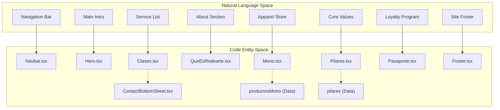
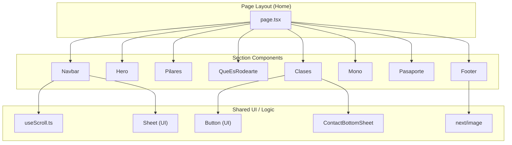

# Page Sections

The Rodearte landing page is a single-page application (SPA) composed of several distinct sections. These sections are assembled in the root `Home` component to create a continuous, scrollable storytelling experience that moves from brand identity to service offerings and community engagement.

### Page Composition

The `Home` component in `src/app/page.tsx` acts as the orchestrator, importing and sequencing every major section of the application.

Sequence of assembly:
1.  `Navbar` (Fixed overlay)
2.  `Hero`
3.  `Pilares`
4.  `QueEsRodearte`
5.  `Clases`
6.  `Mono`
7.  `Pasaporte`
8.  `Footer`

Sources: [src/app/page.tsx:1-35]()

### Section Overview

The following diagram maps the visual sections of the landing page to their corresponding React components and primary data structures.

**Section to Code Entity Mapping**

Sources: [src/app/page.tsx:1-8](), [src/components/sections/Clases.tsx:5-54](), [src/components/sections/Mono.tsx:3-22]()

---

### Navbar
The `Navbar` handles site-wide navigation and brand identity. It utilizes a custom `useScroll` hook to transition between a transparent background and a solid primary color. It features a responsive logo swap logic and a mobile drawer using the `Sheet` component.

For details, see [Navbar](#4.1).
Sources: [src/components/sections/Navbar.tsx:26-132]()

### Hero Section
The `Hero` component serves as the initial "above-the-fold" experience. It uses a full-viewport background image with a gradient overlay to ensure text readability. It includes a responsive testimonial card that adapts its layout between mobile and desktop viewports.

For details, see [Hero Section](#4.2).
Sources: [src/components/sections/Hero.tsx:13-114]()

### Pilares Section
The `Pilares` section highlights the three core brand values: *Cuerpo que piensa*, *Movimiento que libera*, and *Cuidado que acompaña*. It uses a staggered grid layout where images are assigned specific float animations (`animate-float-left`, etc.) and vertical offsets to create a dynamic visual rhythm.

For details, see [Pilares Section](#4.3).
Sources: [src/components/sections/Pilares.tsx:27-95]()

### QueEsRodearte Section
The "About Us" section (`QueEsRodearte`) utilizes a high-impact background image (`aboutUs.avif`) and a glassmorphism-styled card to explain the studio's methodology, focusing on somática creativa and integrative movement.

For details, see [QueEsRodearte Section](#4.4).
Sources: [src/components/sections/QueEsRodearte.tsx:4-71]()

### Clases Section and Contact Bottom Sheet
The `Clases` component iterates through an array of service objects (Full Body, Deep Stretch, etc.), displaying them in a numbered list format. It is tightly integrated with the `ContactBottomSheet`, which provides a Formspree-powered lead generation form.

For details, see [Clases Section and Contact Bottom Sheet](#4.5).
Sources: [src/components/sections/Clases.tsx:56-137](), [src/components/contact/ContactBottomSheet.tsx:20-212]()

### Mono Section (Apparel)
The `Mono` section showcases the Rodearte apparel line. It maps through the `productosMono` data array to render a 3-column grid of product cards, each featuring an overlay with the product name and description.

For details, see [Mono Section (Apparel)](#4.6).
Sources: [src/components/sections/Mono.tsx:24-70]()

### Pasaporte Section
The `Pasaporte` section introduces the attendance passport concept. It uses a full-screen layout with a specific background image (`-.png`) and a centralized information card that utilizes the `animate-fade-in-up` utility for its entrance.

For details, see [Pasaporte Section](#4.7).
Sources: [src/components/sections/Pasaporte.tsx:3-57]()

### Footer
The `Footer` provides the final navigational links and contact information. It organizes data via the `footerLinks` object and includes logic to display different logo variants (`/logos/6.svg` for mobile and `/logos/1.svg` for desktop).

For details, see [Footer](#4.8).
Sources: [src/components/sections/Footer.tsx:23-103]()

---

### Component Hierarchy

The following diagram illustrates how the main `Home` page (Natural Language Space) relates to the specific React Component file structure (Code Entity Space).

**Component Hierarchy Mapping**

Sources: [src/app/page.tsx:1-8](), [src/components/sections/Navbar.tsx:7-15](), [src/components/sections/Clases.tsx:1-3]()

---
