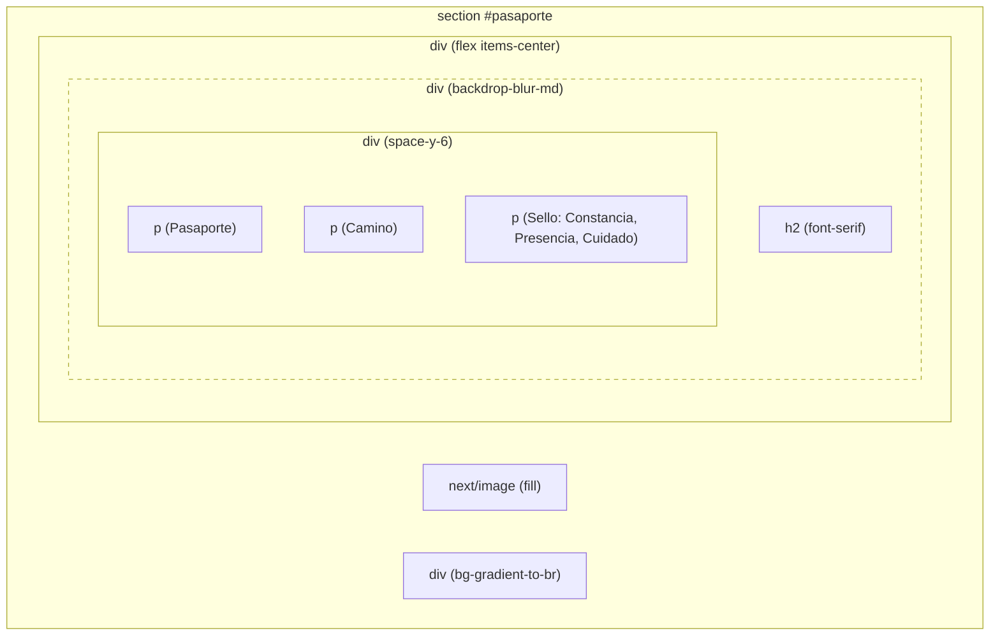
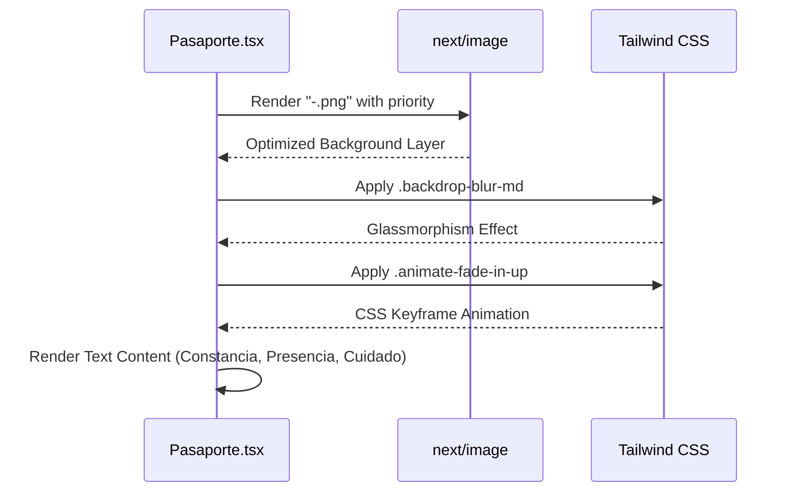

# Pasaporte Section
The **Pasaporte Section** documents the "Pasaporte de Asistencia" (Attendance Passport), a conceptual and physical metaphor used by Rodearte to represent a student's commitment to their practice. This section is implemented as a full-viewport visual experience that combines high-resolution imagery with glassmorphism design patterns.

## Concept and Metaphor

The section centers on the "Pasaporte" concept, which serves as a symbolic tool for tracking progress. The UI emphasizes three core values represented by the "sello" (stamp) metaphor:
*   **Constancia** (Consistency)
*   **Presencia** (Presence)
*   **Cuidado** (Care)

These values are highlighted using the brand's primary color and serif typography to distinguish them from the body text [src/components/sections/Pasaporte.tsx:35-49]().

## Technical Implementation

### Visual Layering
The component uses a layered stacking strategy to achieve depth while maintaining readability:

1.  **Background Layer**: A full-bleed `next/image` using the `fill` property and `object-cover` to ensure the image spans the entire viewport regardless of aspect ratio [src/components/sections/Pasaporte.tsx:9-16]().
2.  **Overlay Layer**: A CSS gradient (`bg-gradient-to-br`) that transitions from a more opaque background color to a more transparent one, ensuring sufficient contrast for the text overlay [src/components/sections/Pasaporte.tsx:17]().
3.  **Content Layer**: A centered container holding a glassmorphism card [src/components/sections/Pasaporte.tsx:19-22]().

### Component Architecture
The following diagram illustrates the structural composition of the `Pasaporte` component:

**Pasaporte Component Structure**

Sources: [src/components/sections/Pasaporte.tsx:5-55]()

### Data and Assets
The section relies on a specific image asset to set the tone of the "attendance passport" on a green table.

| Asset Path | Usage | Implementation Detail |
|:---|:---|:---|
| `public/jpg/-.png` | Background Image | Loaded with `priority` to ensure it is available immediately as a key visual [src/components/sections/Pasaporte.tsx:10-15]() |

Sources: [src/components/sections/Pasaporte.tsx:10](), [public/jpg/-.png:1-40]()

## Styling and Animations

### Glassmorphism
The central card utilizes `backdrop-blur-md` combined with a semi-transparent background (`bg-background/40`) and a subtle border (`border-background/20`). This allows the background image to bleed through while keeping the text legible [src/components/sections/Pasaporte.tsx:22]().

### Responsive Typography
The section employs fluid typography scaling to maintain visual impact across devices:
*   **Heading**: Scales from `text-4xl` on mobile to `text-6xl` on large screens [src/components/sections/Pasaporte.tsx:23]().
*   **Body Text**: Scales from `text-base` to `text-xl` [src/components/sections/Pasaporte.tsx:26]().

### Entry Animation
The content card is wrapped in the `animate-fade-in-up` utility class. This custom animation (defined in the global design system) triggers a smooth upward movement combined with an opacity transition when the section enters the viewport [src/components/sections/Pasaporte.tsx:22]().

## Implementation Flow

The following diagram maps the logical flow from the React component to the rendered DOM elements and their associated styles.

**Component Rendering Flow**

Sources: [src/components/sections/Pasaporte.tsx:3-57]()
