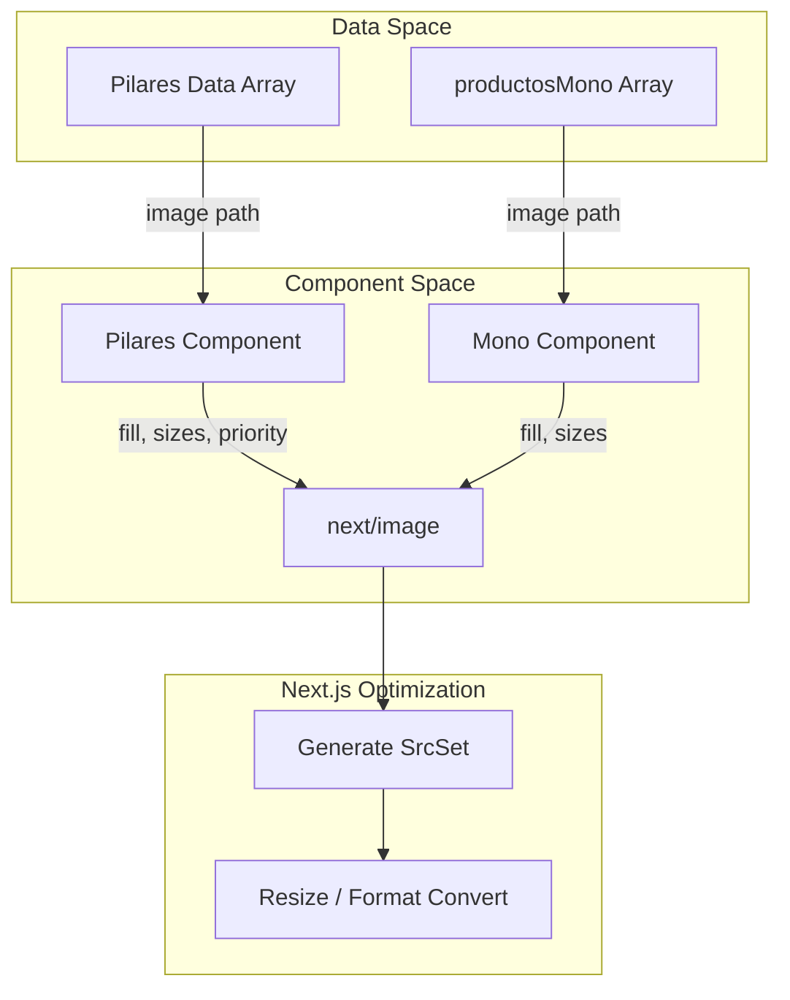

# Photography Assets
This page catalogs the static photography assets located in `public/jpg/`, including the core brand series, section-specific backgrounds, and optimization strategies used within the Next.js framework.

## Image Inventory

The project relies on high-resolution photography to maintain a cohesive visual identity across all sections.

### Rodearte Brand Series
The primary photography consists of a numbered series (`Rodearte_01-XX.jpg`) captured by Ariadna Soto. These images are primarily used in the **Mono** (Apparel) and **Pilares** sections.

| File Name | Primary Usage | Context |
| :--- | :--- | :--- |
| `Rodearte_01-8.jpg` | [src/components/Pilares.tsx:12-12]() | Background for Pillar 1 ("Cuerpo que piensa") |
| `Rodearte_01-22.jpg` | [src/components/Pilares.tsx:18-18]() | Background for Pillar 2 ("Movimiento que libera") |
| `Rodearte_01-47.jpg` | [src/components/Pilares.tsx:24-24]() | Background for Pillar 3 ("Cuidado que acompaña") |
| `Rodearte_01-50.jpg` | [src/components/Mono.tsx:10-10]() | Product image for "Mono Rodearte" |
| `Rodearte_01-64.jpg` | [src/components/Mono.tsx:16-16]() | Product image for "Top Rodearte" |
| `Rodearte_01-78.jpg` | [src/components/Mono.tsx:22-22]() | Product image for "Calza Rodearte" |
| `Rodearte_01-83.jpg` | [src/components/Mono.tsx:28-28]() | Product image for "Conjunto Rodearte" |
| `Rodearte_01-85.jpg` | [src/components/Mono.tsx:34-34]() | Product image for "Accesorio Rodearte" |
| `Rodearte_01-89.jpg` | [src/components/Mono.tsx:40-40]() | Product image for "Kit Rodearte" |

### Section-Specific Assets
These assets are tailored for specific functional backgrounds or placeholder states.

*   **`aboutUs.avif`**: The full-viewport background for the `QueEsRodearte` section [src/components/QueEsRodearte.tsx:8-8]().
*   **`fullbody.jpg`**: Background image for the `Hero` section [src/components/Hero.tsx:10-10]().
*   **`-.png`**: A specialized placeholder image used in the `Hero` section [src/components/Hero.tsx:43-43]().

**Sources:** [src/components/Pilares.tsx](), [src/components/Mono.tsx](), [src/components/QueEsRodearte.tsx](), [src/components/Hero.tsx]()

## Implementation and Optimization

The codebase utilizes the Next.js `next/image` component to handle automatic format conversion (e.g., to WebP/AVIF), resizing, and lazy loading.

### Data Flow for Image Rendering
The following diagram illustrates how image paths from the data layer are passed to the UI components and processed by the Next.js Image optimization engine.

**Image Asset Pipeline**

**Sources:** [src/components/Pilares.tsx:35-42](), [src/components/Mono.tsx:75-82]()

### Configuration Patterns

#### Full-Bleed Backgrounds
For sections like `Hero` and `QueEsRodearte`, the `fill` property is used in conjunction with `object-cover` to ensure the image covers the entire container regardless of aspect ratio.

*   **Priority Loading**: The `Hero` section background (`fullbody.jpg`) is marked with `priority={true}` to prevent LCP (Largest Contentful Paint) delays [src/components/Hero.tsx:14-14]().
*   **Sizing Logic**: Components specify `sizes="100vw"` for full-screen images to inform the browser that the image will occupy the full width of the viewport [src/components/QueEsRodearte.tsx:12-12]().

#### Grid Item Optimization
In the `Mono` apparel grid, images are optimized for responsive columns:
*   **Sizes Attribute**: `sizes="(max-width: 768px) 100vw, (max-width: 1200px) 50vw, 33vw"` [src/components/Mono.tsx:80-80](). This tells the browser to download smaller versions of the images on mobile devices where the grid items are narrower.

### Placeholder Strategy
The `-.png` asset serves as a visual placeholder or secondary layer within the `Hero` section's content block [src/components/Hero.tsx:43-43](). It is rendered with specific dimensions (`width={100}`, `height={100}`) rather than the `fill` pattern used for backgrounds.

**Sources:** [src/components/Hero.tsx:10-43](), [src/components/QueEsRodearte.tsx:8-12](), [src/components/Mono.tsx:75-82]()

## Technical Metadata
Most assets in the `Rodearte_01-XX.jpg` series contain EXIF metadata identifying the equipment used (Sony ILCE-7M3) and the processing software (Adobe Photoshop Lightroom Classic 14.5.1) [public/jpg/Rodearte_01-8.jpg:2-2](). The use of `.avif` for `aboutUs.avif` demonstrates an intentional choice for high-compression, high-quality modern formats [public/jpg/aboutUs.avif:1-1]().

**Sources:** [public/jpg/Rodearte_01-8.jpg](), [public/jpg/aboutUs.avif]()
