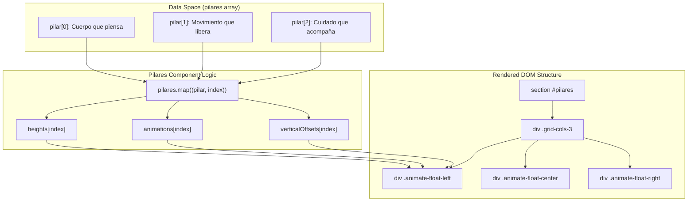
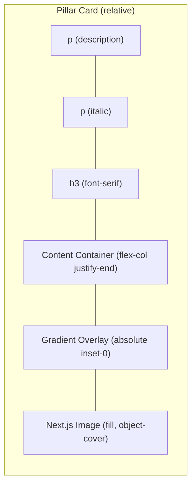

# Pilares Section

The **Pilares** section documents the core philosophical and somatic foundations of Rodearte. It is implemented as a visually dynamic grid featuring staggered layouts, vertical offsets, and custom float animations to reflect the fluid nature of somatic movement.

## Component Overview

The `Pilares` component is a functional React component that iterates over a static data array to render three distinct brand pillars. Each pillar is represented by a high-quality image, a title, a subtitle, and an optional description, all contained within a card that utilizes Next.js image optimization and Tailwind CSS for sophisticated visual effects.

### Brand Pillars Data Structure
The content is driven by the `pilares` constant, which defines the thematic elements for each card.

| Pillar Title | Subtitle | Image Path | Position |
|:---|:---|:---|:---|
| "Cuerpo que piensa" | "El movimiento como lenguaje interior." | `/jpg/Rodearte_01-89.jpg` | left |
| "Movimiento que libera" | "Pequeños gestos que transforman tu día." | `/jpg/Rodearte_01-64.jpg` | center |
| "Cuidado que acompaña" | "Clases que sostienen tu ritmo, tus días y tu proceso." | `/jpg/Rodearte_01-93.jpg` | right |

Sources: `[src/components/sections/Pilares.tsx:3-25]()`

## Technical Implementation

### Staggered Grid Layout
The section uses a responsive grid (`grid-cols-1 md:grid-cols-3`) with specific vertical offsets to create a non-linear, organic aesthetic.

*   **Vertical Offsets**: Managed via the `verticalOffsets` array.
    *   Index 0: `-mt-8 md:-mt-12` (Shifted upwards).
    *   Index 1: `mt-12 md:mt-16` (Shifted downwards).
    *   Index 2: `mt-0` (Neutral).
*   **Variable Heights**: Each card has a different height defined in the `heights` array to further break the grid symmetry.
    *   Left: `h-[380px] md:h-[420px]`
    *   Center: `h-[480px] md:h-[520px]`
    *   Right: `h-[360px] md:h-[400px]`

Sources: `[src/components/sections/Pilares.tsx:43-60]()`

### Visual Effects and Animations
Each pillar card is assigned a unique float animation based on its index in the `pilares` array.

1.  **Float Animations**:
    *   `animate-float-left`
    *   `animate-float-center`
    *   `animate-float-right`
2.  **Gradient Overlays**: Each card contains an absolute-positioned `div` with a gradient (`bg-gradient-to-t from-primary/85 via-primary/40 to-transparent`) to ensure text readability against the background image.
3.  **Image Handling**: Uses `next/image` with the `fill` property and `object-cover` to maintain aspect ratio within the variable-height containers.

Sources: `[src/components/sections/Pilares.tsx:50-54]()`, `[src/components/sections/Pilares.tsx:66-74]()`

## Architecture Diagrams

### Component Composition
This diagram illustrates how the `Pilares` component maps its internal data structure to the rendered DOM elements and CSS classes.

**Pillar Rendering Logic**

Sources: `[src/components/sections/Pilares.tsx:27-95]()`

### Visual Layering and Styling
This diagram breaks down the layering strategy used within an individual pillar card to achieve the "glassmorphism" and gradient effect.

**Pillar Card Layer Stack**

Sources: `[src/components/sections/Pilares.tsx:66-87]()`

## Component Props and Styling Reference

### Tailwind Class Breakdown
The component uses the following key utility classes:

| Element | Class | Purpose |
|:---|:---|:---|
| Section Wrapper | `bg-primary` | Sets the dark brand background color. |
| Section Title | `text-background` | Uses the light background color variable for text contrast. |
| Pillar Card | `rounded-2xl overflow-hidden` | Creates the rounded aesthetic and clips the internal image. |
| Pillar Card | `shadow-2xl` | Adds depth to the floating elements. |
| Image Overlay | `from-primary/85` | Ensures the bottom of the card is dark enough for text legibility. |

Sources: `[src/components/sections/Pilares.tsx:29-33]()`, `[src/components/sections/Pilares.tsx:64-74]()`

---
