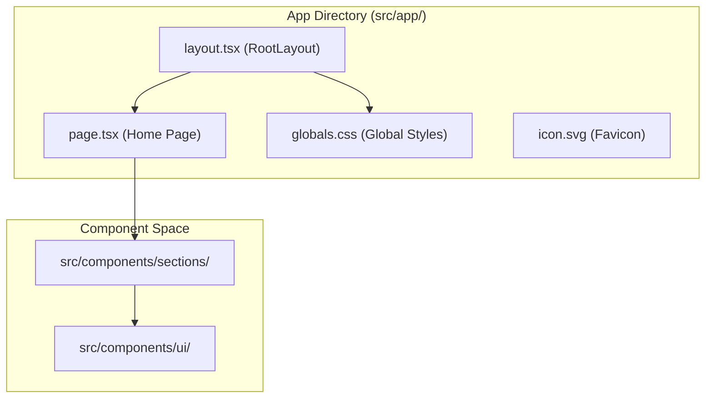
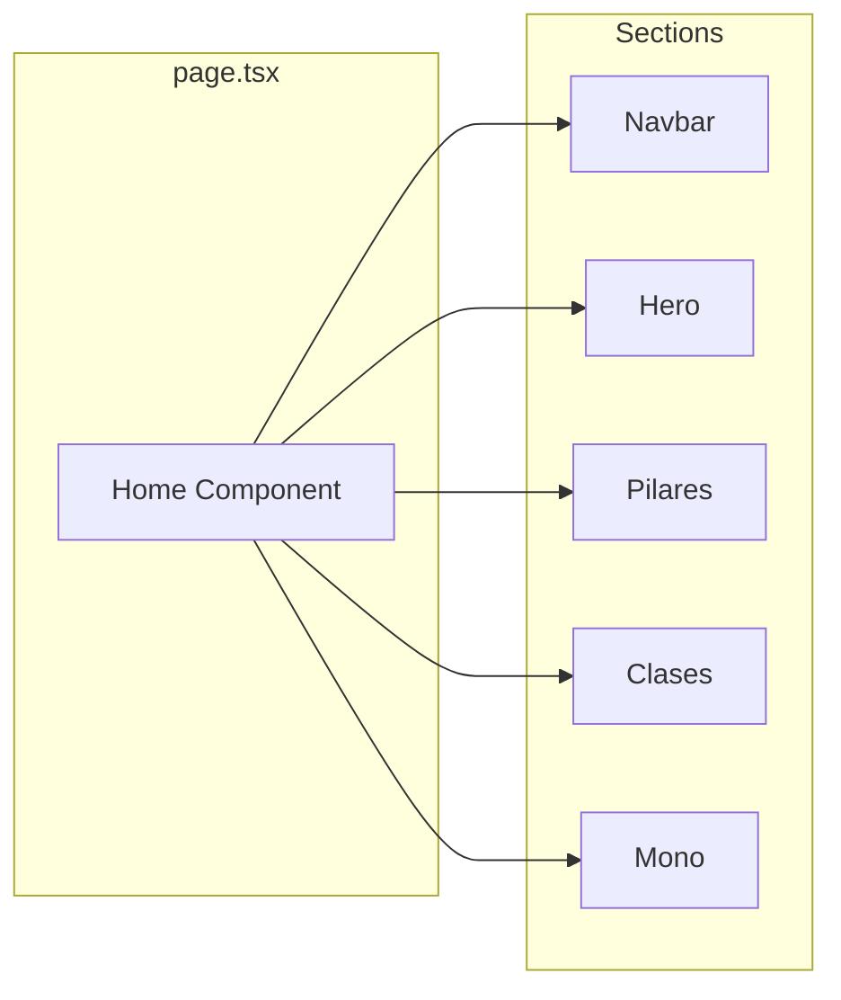

# Project Structure
This page details the organizational layout of the Rodearte codebase. The project follows a modern Next.js 14+ architecture using the App Router, TypeScript for type safety, and Tailwind CSS for styling. The structure is designed to separate concerns between reusable UI primitives, domain-specific page sections, and application logic.

## High-Level Directory Overview

The project is organized into two primary root directories: `src/` for source code and `public/` for static assets.

### The `src/` Directory

The `src/` directory contains the core application logic, components, and styling. It is subdivided into functional folders that separate infrastructure from UI.

| Folder | Purpose |
| :--- | :--- |
| `app/` | Contains the Next.js App Router files, including routes, layouts, and global styles. |
| `components/` | Divided into `ui/` (shadcn primitives) and `sections/` (landing page building blocks). |
| `hooks/` | Custom React hooks for shared logic (e.g., scroll handling). |
| `lib/` | Utility functions and shared helpers (e.g., `cn` for Tailwind merging). |
| `types/` | Global TypeScript interfaces and type definitions. |

**Sources:** [README.md:12-26](), [components.json:13-19]()

### The `public/` Directory

The `public/` directory contains static assets served directly by the web server.
*   `jpg/`: High-resolution photography used in sections like Hero and Clases.
*   `logos/`: A library of SVG logo variants (1.svg to 29.svg) used across the Navbar and Footer.

---

## Next.js App Router Architecture

The `src/app` directory implements the Next.js App Router conventions. It handles the entry point of the application and global configuration.

### File Mapping and Data Flow

The following diagram illustrates how the file system maps to the rendered application structure:

**Next.js App Router Mapping**

*   **`layout.tsx`**: Defines the `RootLayout` which wraps all pages. It initializes the `Noto_Serif_Display` and `Montserrat` fonts and sets the HTML `lang="es"` attribute. [src/app/layout.tsx:5-34]()
*   **`page.tsx`**: The main entry point for the landing page. It imports and sequences all major sections of the site. [src/app/page.tsx:1-35]()
*   **`globals.css`**: Contains Tailwind directives and CSS variable definitions for the color palette. [src/app/globals.css:1-3]()

**Sources:** [src/app/layout.tsx:1-34](), [src/app/page.tsx:1-35]()

---

## Component Organization

The `src/components/` directory is split to distinguish between generic UI atoms and specific page sections.

### UI Primitives (`src/components/ui/`)
These are low-level, reusable components managed via `shadcn/ui`. They are typically stateless or provide basic UI behavior (like buttons or modal sheets).
*   **`button.tsx`**: Standardized button variants using `class-variance-authority`.
*   **`sheet.tsx`**: Drawer/Sidebar implementation based on Radix UI.

### Page Sections (`src/components/sections/`)
These are complex components that represent distinct horizontal slices of the landing page. Each section is imported into the main `page.tsx`.

**Component Composition Flow**

**Sources:** [src/app/page.tsx:1-8](), [README.md:20-22]()

---

## Infrastructure and Utilities

The supporting directories provide the logic and type safety required by the UI components.

### 1. `src/lib/`
Contains shared utility functions. A primary utility is `cn` (defined in `utils.ts`), which combines `clsx` and `tailwind-merge` to handle dynamic class names efficiently. [components.json:15-15]()

### 2. `src/hooks/`
Contains custom React hooks. These encapsulate logic like `useScroll`, which is used by the `Navbar` to change its appearance when the user scrolls past a certain threshold. [README.md:24-24]()

### 3. `src/types/`
Centralizes TypeScript definitions to ensure consistency across components.
*   **`NavItem`**: Defines the structure for navigation links (`label`, `href`). [src/types/index.ts:3-6]()
*   **`Feature`**: Defines the structure for informational cards used in sections like Pilares. [src/types/index.ts:8-12]()

**Sources:** [src/types/index.ts:1-12](), [components.json:13-19]()
