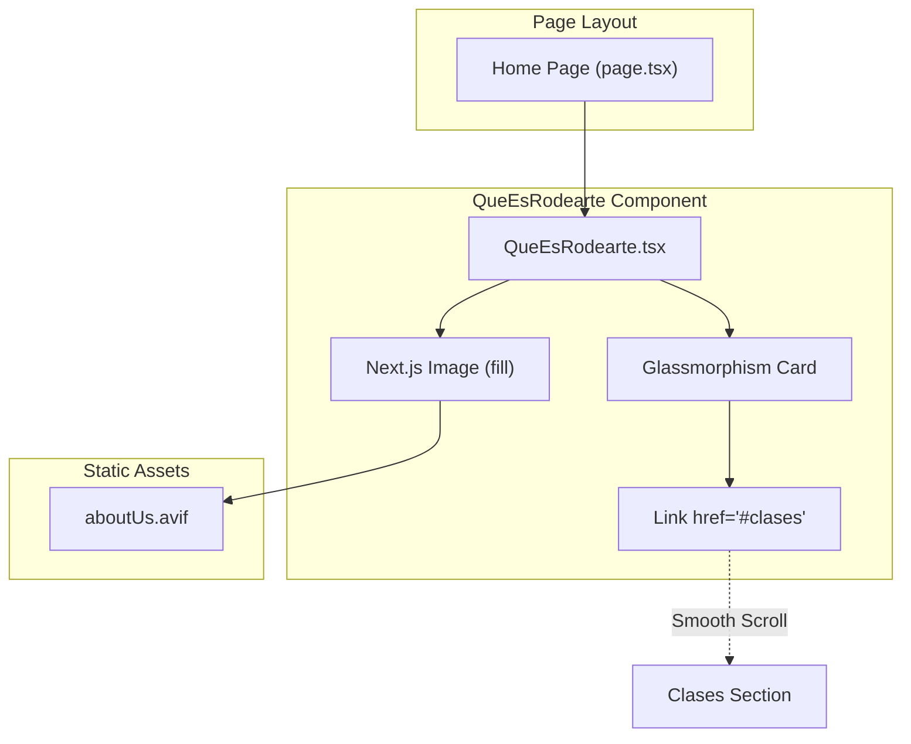
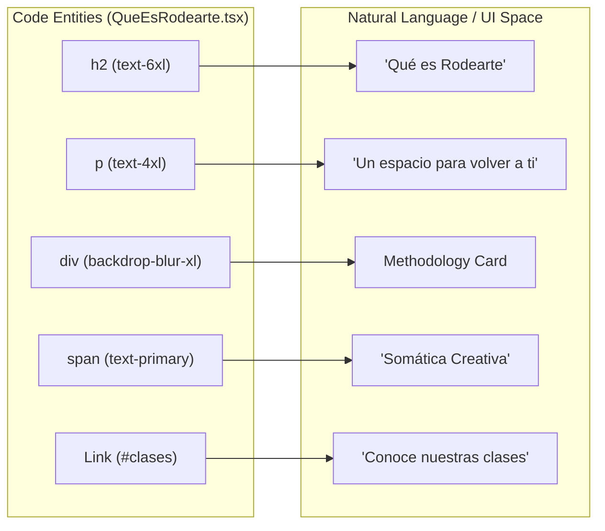

# QueEsRodearte Section

The `QueEsRodearte` section (referenced in the UI as "Sobre") serves as the "About Us" narrative for the application. It utilizes a full-viewport layout to establish a serene visual atmosphere, combining high-quality imagery with glassmorphism-based typography to communicate the studio's methodology and core values.

## Implementation Details

The section is implemented as a functional React component within the Next.js App Router structure. It is anchored by the `id="sobre"` attribute, allowing for smooth-scroll navigation from the Navbar.

### Visual Layering
The component uses a three-layer stacking strategy:
1.  **Background Layer**: A full-bleed `Next.js Image` component using the `fill` property [src/components/sections/QueEsRodearte.tsx:10-17](). It loads `aboutUs.avif` with `priority` to ensure it is available immediately as the user scrolls [src/components/sections/QueEsRodearte.tsx:11-16]().
2.  **Overlay Layer**: A CSS gradient (`bg-gradient-to-br`) from `background/40` to `transparent` is applied to ensure text readability against the photographic background [src/components/sections/QueEsRodearte.tsx:18]().
3.  **Content Layer**: A `z-10` container that holds the heading and the information card [src/components/sections/QueEsRodearte.tsx:20]().

### The Information Card (Glassmorphism)
The descriptive text is housed in a card positioned at the bottom-right of the viewport [src/components/sections/QueEsRodearte.tsx:33-34](). It utilizes several Tailwind utility classes to achieve a "glass" effect:
*   **Blur**: `backdrop-blur-xl` for background frosting [src/components/sections/QueEsRodearte.tsx:34]().
*   **Gradient**: `bg-gradient-to-br from-primary/90 via-primary/80 to-primary/70` [src/components/sections/QueEsRodearte.tsx:34]().
*   **Border**: A subtle `border-white/25` to define the edges [src/components/sections/QueEsRodearte.tsx:34]().

**Sources:**
* [src/components/sections/QueEsRodearte.tsx:4-71]()
* [public/jpg/aboutUs.avif:1]()

---

## Data Flow and Navigation

The section acts as a bridge between the brand's identity and its service offerings. It includes a functional link that redirects the user further down the page to the classes section.

### Component Relationship Diagram
This diagram shows how the `QueEsRodearte` component relates to the global page structure and assets.

**QueEsRodearte Architecture**

**Sources:**
* [src/components/sections/QueEsRodearte.tsx:11-13]()
* [src/components/sections/QueEsRodearte.tsx:58-63]()

---

## Methodology Keywords

The section highlights three specific keywords that define the Rodearte methodology. These are styled with specific font weights and colors to draw the eye.

| Keyword | Styling | Code Entity |
| :--- | :--- | :--- |
| **Somática creativa** | `font-serif font-bold text-background` | `` [src/components/sections/QueEsRodearte.tsx:38-40]() |
| **Movimiento integrativo** | `font-serif font-semibold text-secondary` | `` [src/components/sections/QueEsRodearte.tsx:42-44]() |
| **Escucha profunda** | `font-serif font-semibold text-background/80` | `` [src/components/sections/QueEsRodearte.tsx:46-48]() |

### Code-to-UI Mapping
This diagram maps the technical implementation of the card's content to the visual hierarchy.

**Content Mapping**

**Sources:**
* [src/components/sections/QueEsRodearte.tsx:23-28]()
* [src/components/sections/QueEsRodearte.tsx:34-50]()
* [src/components/sections/QueEsRodearte.tsx:58-63]()

## Responsive Design
The section adjusts its layout based on screen size:
*   **Typography**: Headings scale from `text-4xl` on mobile to `text-6xl` on large screens [src/components/sections/QueEsRodearte.tsx:23]().
*   **Padding**: Top padding increases from `pt-32` (mobile) to `pt-48` (desktop) to account for the fixed Navbar height [src/components/sections/QueEsRodearte.tsx:21]().
*   **Card Width**: The information card is set to `max-w-md w-full`, ensuring it remains readable on small devices while maintaining its compact "card" appearance on desktop [src/components/sections/QueEsRodearte.tsx:34]().

**Sources:**
* [src/components/sections/QueEsRodearte.tsx:21-26]()
* [src/components/sections/QueEsRodearte.tsx:34-36]()

---
