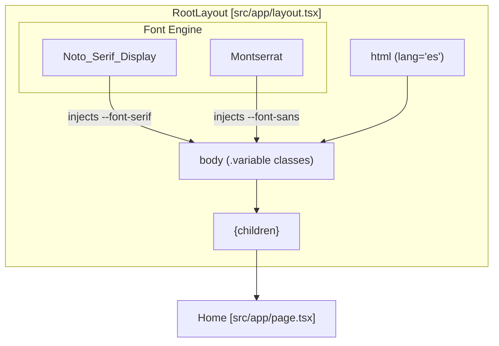

# Root Layout and Page Composition

This page details the architectural foundation of the Rodearte application, focusing on the root configuration, font integration, and the structural composition of the landing page.

## Root Layout and Global Configuration

The `RootLayout` serves as the entry point for the entire application, establishing the HTML structure, language settings, and global font variables. It wraps all page content within a standard Next.js App Router structure.

### Metadata and Language
The application is configured with Spanish (`es`) as the primary language [src/app/layout.tsx:28-28](). Metadata is defined statically to set the application title and description [src/app/layout.tsx:17-20]().

### Font Loading Strategy
Rodearte utilizes two primary typefaces from Google Fonts, managed via `next/font/google` to optimize performance and prevent Layout Shift (CLS).

| Font | Variable | Role | Subsets |
| :--- | :--- | :--- | :--- |
| **Noto Serif Display** | `--font-serif` | Headings and brand accents | Latin |
| **Montserrat** | `--font-sans` | Body text and navigation | Latin |

The fonts are injected into the DOM as CSS variables [src/app/layout.tsx:7-7](), [src/app/layout.tsx:13-13](). The `Montserrat` font is set as the default `font-sans` for the `<body>` element [src/app/layout.tsx:29-29](). Both fonts use `display: "swap"` to ensure text remains visible during font loading [src/app/layout.tsx:8-14]().

### Implementation Diagram: Layout Structure
The following diagram illustrates how `RootLayout` wraps the application content and provides the CSS variable context for the design system.

**Layout Hierarchy and CSS Variable Injection**

Sources: [src/app/layout.tsx:1-34]()

---

## Page Composition

The Rodearte landing page is a single-page architecture composed within `src/app/page.tsx`. It assembles multiple specialized section components into a linear vertical flow.

### Component Assembly
The `Home` component acts as the orchestrator, importing sections from `@/components/sections/*` and placing them within a `<main>` container that ensures a minimum screen height [src/app/page.tsx:10-35]().

The sequence of sections is as follows:
1.  **Navbar**: Persistent navigation (placed outside `<main>` for global positioning) [src/app/page.tsx:13-13]().
2.  **Hero**: The primary visual entry point [src/app/page.tsx:15-15]().
3.  **Pilares**: Core brand values and philosophy [src/app/page.tsx:18-18]().
4.  **QueEsRodearte**: Detailed description of the methodology [src/app/page.tsx:21-21]().
5.  **Clases**: Service offerings and scheduling [src/app/page.tsx:24-24]().
6.  **Mono**: Apparel and product showcase [src/app/page.tsx:27-27]().
7.  **Pasaporte**: Engagement and attendance concept [src/app/page.tsx:30-30]().
8.  **Footer**: Contact information and site map [src/app/page.tsx:32-32]().

### Data Flow and Component Tree
The following diagram maps the relationship between the `Home` page and its constituent section components.

**Rodearte Page Composition Tree**
```mermaid
graph DT
    PAGE["Home (src/app/page.tsx)"]
    
    NAV["Navbar"]
    MAIN["main (.min-h-screen)"]
    FOOT["Footer"]

    subgraph "Sections"
        HERO["Hero"]
        PIL["Pilares"]
        QER["QueEsRodearte"]
        CLA["Clases"]
        MON["Mono"]
        PAS["Pasaporte"]
    end

    PAGE --> NAV
    PAGE --> MAIN
    PAGE --> FOOT

    MAIN --> HERO
    MAIN --> PIL
    MAIN --> QER
    MAIN --> CLA
    MAIN --> MON
    MAIN --> PAS
```
Sources: [src/app/page.tsx:1-35]()

### Key Layout Classes
*   **`min-h-screen`**: Applied to the `<main>` tag to ensure the background and layout span at least the full viewport height even if content is sparse [src/app/page.tsx:14-14]().
*   **`font-sans`**: Applied at the `<body>` level to ensure `Montserrat` is the fallback font for all child components unless overridden [src/app/layout.tsx:29-29]().

Sources: [src/app/layout.tsx:1-34](), [src/app/page.tsx:1-35]()

---
