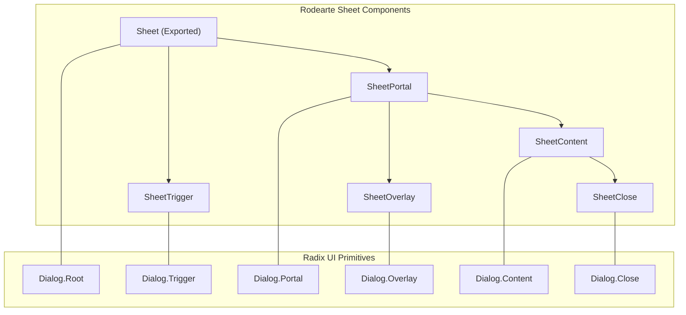
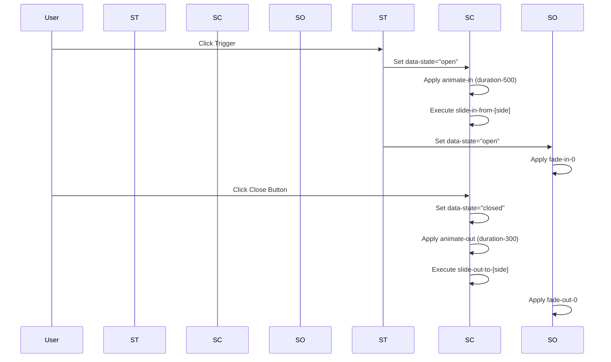

# Sheet (Drawer) Component

The Sheet component is a slide-out panel (often referred to as a "Drawer") used for mobile navigation, supplementary forms, and contextual information. It is built upon the `@radix-ui/react-dialog` primitive, ensuring accessibility (ARIA patterns, focus trapping) while providing custom styling and animations via Tailwind CSS and `class-variance-authority` (CVA).

## Component Architecture

The Sheet implementation is composed of several sub-components that manage the portal, overlay, content, and accessibility labels. It utilizes a declarative pattern where the `Sheet` component acts as a state provider for its children.

### Component Relationship Diagram

The following diagram illustrates the relationship between the exported components and the underlying Radix UI primitives.

**Sheet Component Hierarchy**

Sources: [src/components/ui/sheet.tsx:10-16](), [src/components/ui/sheet.tsx:56-74]()

## Implementation Details

### Side Variants and CVA
The component supports four entry directions (top, bottom, left, right) defined via the `sheetVariants` CVA configuration. This configuration handles both the positioning and the corresponding entry/exit animations.

| Side | CSS Classes | Animation (In/Out) |
| :--- | :--- | :--- |
| `top` | `inset-x-0 top-0 border-b` | `slide-in-from-top` / `slide-out-to-top` |
| `bottom` | `inset-x-0 bottom-0 border-t` | `slide-in-from-bottom` / `slide-out-to-bottom` |
| `left` | `inset-y-0 left-0 h-full w-3/4 border-r` | `slide-in-from-left` / `slide-out-to-left` |
| `right` | `inset-y-0 right-0 h-full w-3/4 border-l` | `slide-in-from-right` / `slide-out-to-right` |

Sources: [src/components/ui/sheet.tsx:33-50]()

### Sub-Component Definitions

*   **`SheetOverlay`**: A full-screen backdrop that dims the background (`bg-black/80`). It uses Radix state attributes (`data-state`) to trigger fade animations [src/components/ui/sheet.tsx:18-30]().
*   **`SheetContent`**: The main container for the drawer content. It automatically wraps its children in a `SheetPortal` and `SheetOverlay`, and includes a built-in `SheetClose` button (the "X" icon) in the top-right corner [src/components/ui/sheet.tsx:56-74]().
*   **`SheetHeader` / `SheetFooter`**: Layout utilities for consistent spacing within the drawer. `SheetFooter` automatically switches from a vertical stack on mobile to a horizontal row on larger screens [src/components/ui/sheet.tsx:77-103]().
*   **`SheetTitle` / `SheetDescription`**: Semantic components for accessibility. These map to `Dialog.Title` and `Dialog.Description` to ensure screen readers properly identify the drawer's purpose [src/components/ui/sheet.tsx:105-127]().

## Data Flow and Animations

The Sheet component relies on Tailwind CSS's animation utilities and Radix UI's state management to handle transitions.

**Animation Logic Flow**

Sources: [src/components/ui/sheet.tsx:24-24](), [src/components/ui/sheet.tsx:34-44](), [src/components/ui/sheet.tsx:68-71]()

### Key Classes and Functions

| Entity | Role | Source |
| :--- | :--- | :--- |
| `Sheet` | Alias for `SheetPrimitive.Root`, manages open/closed state. | [src/components/ui/sheet.tsx:10-10]() |
| `SheetPortal` | Teleports the drawer to the end of the `<body>` to avoid z-index nesting issues. | [src/components/ui/sheet.tsx:16-16]() |
| `SheetContent` | Functional component that applies `sheetVariants` based on the `side` prop. | [src/components/ui/sheet.tsx:56-74]() |
| `cn(...)` | Utility used to merge default variant styles with custom `className` props. | [src/components/ui/sheet.tsx:64-64]() |
| `X` | Icon from `lucide-react` used for the close button. | [src/components/ui/sheet.tsx:6-6]() |

Sources: [src/components/ui/sheet.tsx:1-140]()

---
