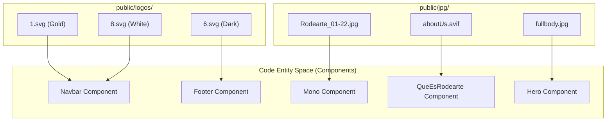
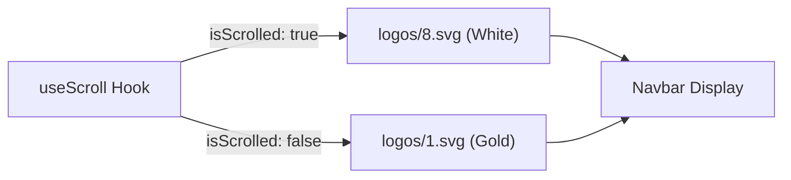

# Static Assets
This section provides an overview of the static files served by the Rodearte application. These assets are located in the `public/` directory and include the high-resolution photography used for sections and product displays, as well as the comprehensive SVG logo library used for branding across different UI states.

## Overview of the public/ Directory

The `public/` directory contains all non-code assets that are served directly to the browser. These assets are critical for the "Somatic Movement" aesthetic of the site, utilizing glassmorphism and high-quality imagery to convey the brand's identity.

### Directory Structure

The assets are organized into two primary subdirectories:

| Directory | Content Type | Primary Usage |
| :--- | :--- | :--- |
| `public/jpg/` | Photography & Backgrounds | Section backgrounds, product images, and placeholders. |
| `public/logos/` | SVG Branding | Responsive logos for Navbar, Footer, and scroll states. |
| `src/app/icon.svg` | Favicon / App Icon | Browser tab branding and Next.js metadata. |

### Mapping Assets to Code Entities

The following diagram illustrates how static assets are associated with specific React components within the `src/components/` directory.

**Asset-to-Component Mapping**

Sources: [src/app/layout.tsx:1-40](), [public/logos/1.svg:1-10](), [public/jpg/Rodearte_01-22.jpg:1-10]()

---

## Photography Assets

The photography assets are the visual core of the Rodearte experience. They are primarily served using the Next.js `Image` component to ensure optimization, lazy loading, and appropriate sizing across devices.

*   **Rodearte Series**: A collection of high-resolution images (e.g., `Rodearte_01-22.jpg`) used in the `Mono` section to showcase apparel.
*   **Backgrounds**: Specific files like `aboutUs.avif` and `fullbody.jpg` serve as full-viewport or container-bounded backgrounds for narrative sections.
*   **Placeholders**: The `-.png` file is used as a lightweight placeholder during image loading or for missing assets.

For a full catalog of images and their technical implementation details (sizes, priority, and fill patterns), see **[Photography Assets](#5.1)**.

Sources: [public/jpg/Rodearte_01-22.jpg:1-46]()

---

## Logo SVG Library

Rodearte utilizes a library of 29 numbered SVG files to handle complex branding requirements. Because the site uses a scroll-responsive `Navbar` and a multi-themed `Footer`, the application swaps between different logo variants based on the UI state.

### Key Branding Assets

| Asset Path | Role | Usage Context |
| :--- | :--- | :--- |
| `public/logos/1.svg` | Primary Logo | Default Navbar state and Desktop Footer. |
| `public/logos/8.svg` | Light Variant | Navbar when scrolled (overlaying dark content). |
| `public/logos/6.svg` | Mobile Variant | Compact Footer view for mobile devices. |
| `src/app/icon.svg` | System Icon | Generated favicon for the Next.js App Router. |

### Logo State Logic
The `Navbar` component dynamically selects the logo based on the `isScrolled` state provided by the `useScroll` hook.

**Navbar Logo Logic**

For details on the full library and the implementation of the app icon, see **[Logo SVG Library](#5.2)**.

Sources: [src/app/icon.svg:1-10](), [public/logos/1.svg:1-10]()
