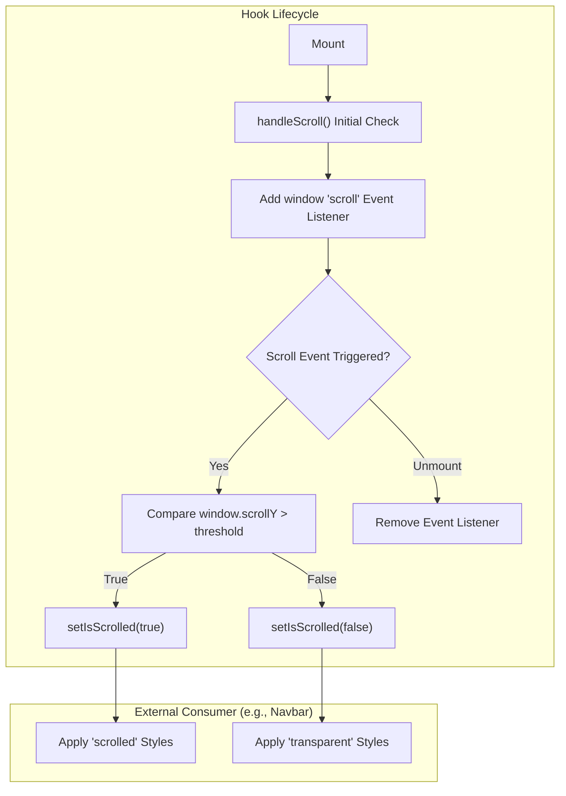

# Utilities, Hooks, and Types
This section covers the foundational infrastructure of the Rodearte codebase, including the utility functions for styling, custom React hooks for browser interaction, and global TypeScript interfaces that define the data structures used across multiple components.

## Class Merging Utility

The project utilizes a standard utility function, `cn`, to manage dynamic Tailwind CSS class names. This utility is essential for building flexible UI components that need to merge base styles with conditional classes or external overrides.

### Implementation Details
The `cn` function is a wrapper around two industry-standard libraries:
1.  **`clsx`**: A utility for constructing `className` strings conditionally [src/lib/utils.ts:1-1]().
2.  **`tailwind-merge`**: Specifically designed to resolve Tailwind CSS class conflicts (e.g., ensuring `px-4` overrides `p-2`) [src/lib/utils.ts:2-2]().

The function accepts a spread of `ClassValue` inputs and returns a single merged string [src/lib/utils.ts:4-6]().

### Data Flow: Styling
| Step | Process | Code Entity |
| :--- | :--- | :--- |
| 1 | Input raw classes and conditions | `cn("base-style", isActive && "active-style", props.className)` |
| 2 | Conditional logic resolution | `clsx` [src/lib/utils.ts:5-5]() |
| 3 | Conflict resolution | `twMerge` [src/lib/utils.ts:5-5]() |
| 4 | Output | Optimized string for the `className` attribute |

**Sources:**
- [src/lib/utils.ts:1-8]()

## Custom Hooks: useScroll

The `useScroll` hook is a client-side utility used to track the user's vertical scroll position relative to a specific threshold. In the Rodearte application, this is primarily used by the `Navbar` to trigger visual transitions (such as logo swaps or background opacity changes) when the user moves away from the top of the page.

### Technical Specification
The hook encapsulates the following logic:
- **State Management**: Maintains an `isScrolled` boolean state [src/hooks/useScroll.ts:6-6]().
- **Event Handling**: Attaches a passive scroll listener to the `window` object [src/hooks/useScroll.ts:17-17]().
- **Threshold Logic**: Compares `window.scrollY` against a configurable `threshold` (defaulting to 50 pixels) [src/hooks/useScroll.ts:5-11]().
- **Lifecycle**: Includes a cleanup function to remove the event listener when the component unmounts, preventing memory leaks [src/hooks/useScroll.ts:19-21]().

### Scroll Detection Logic
The diagram below illustrates the lifecycle and state transitions within the `useScroll` hook.

**Logic Flow: useScroll Hook**


**Sources:**
- [src/hooks/useScroll.ts:1-27]()

## Global Type Definitions

The application defines shared TypeScript interfaces to ensure type safety across navigation and feature-based components. These are centralized to provide a single source of truth for the data shapes used in the landing page sections.

### NavItem Interface
Used for defining navigation links in both the desktop `Navbar` and the mobile `Sheet` menu.
- `label`: The display text for the link [src/types/index.ts:4-4]().
- `href`: The destination anchor (e.g., `#clases`) or URL [src/types/index.ts:5-5]().

### Feature Interface
Used to model informational blocks, such as the pillars of the brand or service descriptions.
- `title`: The heading of the feature [src/types/index.ts:9-9]().
- `description`: Detailed text content [src/types/index.ts:10-10]().
- `icon`: An optional string identifier for an icon or asset path [src/types/index.ts:11-11]().

### Data Structure Mapping
The following diagram bridges the natural language concepts of the website's content to the code entities defined in the types file.

**Conceptual Mapping: Rodearte Data Types**
```mermaid
classDiagram
    class "Navigation Menu" as NavMenu {
        +String label
        +String href
    }
    class "Brand Pillar / Service" as BrandFeature {
        +String title
        +String description
        +String icon (optional)
    }

    class NavItem {
        <<interface>>
        +label: string
        +href: string
    }
    class Feature {
        <<interface>>
        +title: string
        +description: string
        +icon?: string
    }

    NavMenu ..> NavItem : "Implemented as"
    BrandFeature ..> Feature : "Implemented as"
```

**Sources:**
- [src/types/index.ts:1-14]()
